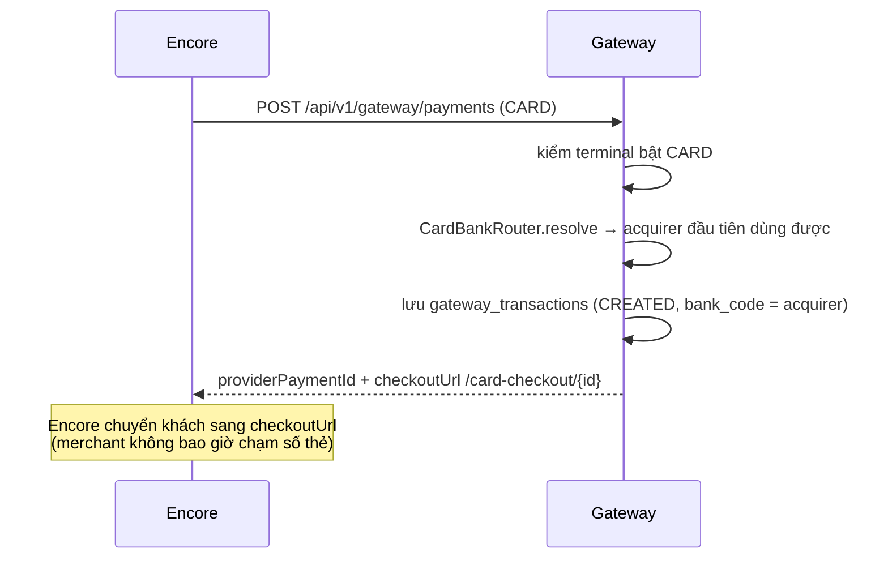
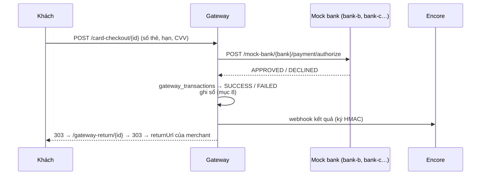
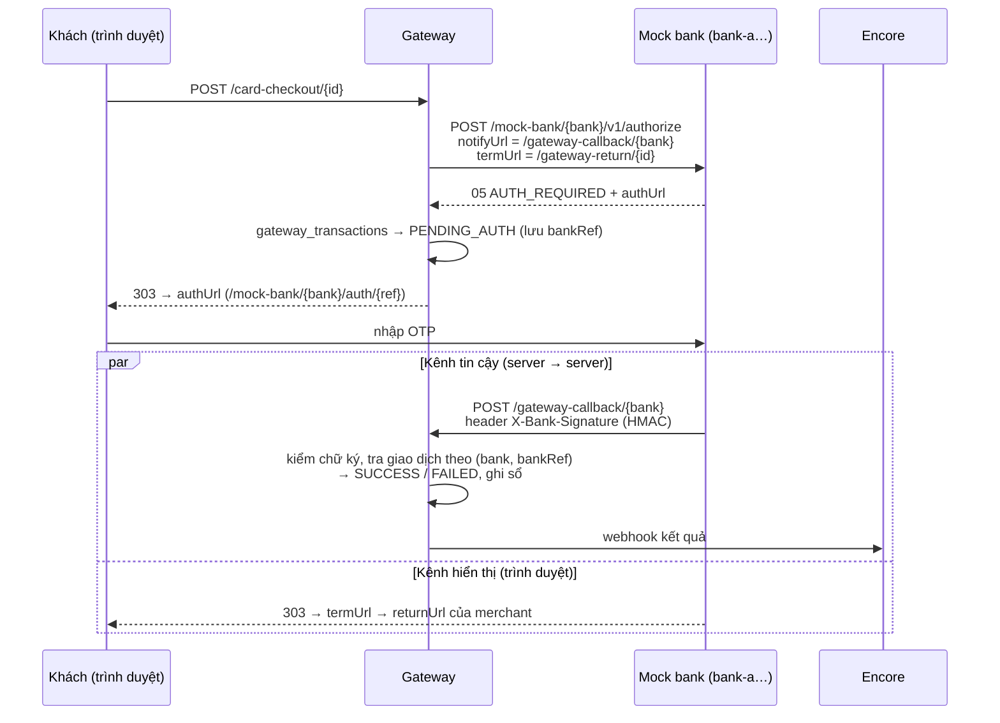
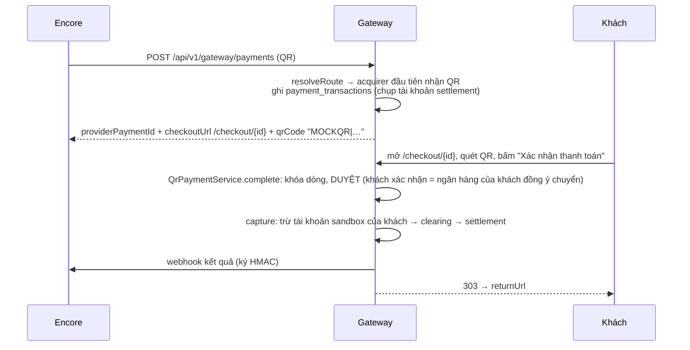

# Luồng Gateway → Bank

> Mới vào dự án? Đọc `GATEWAY-CODE-WALKTHROUGH.md` trước: giải thích từ khái niệm thanh toán, Spring tối thiểu, tới
> từng class, kèm bài tập chạy thật.

Tài liệu này mô tả chuyện xảy ra **sau khi** merchant (Encore) đã gửi lệnh thanh toán cho gateway: gateway chọn
ngân hàng nào, nói chuyện với ngân hàng ra sao, ngân hàng trả lời thế nào, và tiền đi đâu. Viết theo code ngày
2026-10-08.

> Đọc kèm: `CLAUDE.md` ở thư mục gốc (mục "Mô hình thanh toán" và "Mock gateway").

---

## 1. Ai là ai

| Vai | Trong code | Biết gì | Không biết gì |
|---|---|---|---|
| **Merchant** | Encore (`be/`), mỗi BTC một merchant | merNo, terminalId, secret của mình | acquirer, routing, mock bank |
| **Gateway** | `bankSimulate` (`com.bankSimulate.application.*`) | terminal, routing profile, acquirer, Acquirer Connection | thẻ của khách có hợp lệ không (đó là việc của bank) |
| **Acquirer** | dòng trong bảng `acquirers` | — (chỉ là dữ liệu: method nhận được + có 3DS hay không) | — |
| **Mock bank** | `com.bankSimulate.mockbank.*` | số thẻ, OTP | merchant config, acquirer, routing, danh sách bank |

Mock bank đóng vai **cả acquirer lẫn issuer** (ngân hàng phát hành thẻ của khách). Nó chỉ làm một việc:
**duyệt hoặc từ chối** (kiểu 3DS thì hỏi OTP trước khi quyết).

Mock bank chạy chung process với gateway (cùng port 8090) cho tiện, nhưng gateway gọi nó **qua HTTP như gọi hệ thống
ngoài**. Phía gateway chỉ dùng chung các record DTO trong `mockbank/web/dto` (để khỏi khai lại JSON), không gọi
method nào của `mockbank.*`.

---

## 2. Bức tranh chung

```mermaid
flowchart LR
    M[Merchant<br/>Encore] -->|POST /api/v1/gateway/payments<br/>X-Merchant-No/-Terminal-Id/-Secret| G[Gateway]
    G -->|1. chọn route| R[(Terminal → RoutingProfile<br/>→ RoutingRule → Acquirer)]
    G -->|2a. THẺ: HTTP| MB[Mock bank<br/>/mock-bank/{bank}/…]
    MB -.->|3DS: callback ký HMAC<br/>/gateway-callback/{bank}| G
    G -->|2b. QR/ví: khách xác nhận<br/>trên trang gateway| C[Khách]
    G -->|3. ghi sổ: CAPTURE → SETTLEMENT| L[(sandbox_ledger_entries<br/>sandbox_merchant_accounts)]
    G -->|4. webhook ký HMAC| M
```

Có **hai luồng** vì hai loại phương thức được xử lý khác nhau:

| | Thẻ (`CARD`) | QR / ví (`QR`, `PAYNOW`, `GOOGLE_PAY`, `APPLE_PAY`) |
|---|---|---|
| Service | `CardPaymentService` | `QrPaymentService` |
| Trạng thái lưu ở | DB: `payment_transactions` (bảng chính) + `gateway_transactions` (chi tiết ủy quyền thẻ: bank, `bank_ref`, thẻ đã che), ghi cùng transaction | DB: `payment_transactions` (không cần bảng chi tiết). Trước đây nằm trong RAM, xem `GATEWAY-CODE-WALKTHROUGH.md` mục 8 |
| Gọi mock bank qua HTTP | **Có** | Không: khách bấm xác nhận = ngân hàng của khách duyệt |
| Trang khách thấy | `/card-checkout/{id}` (nhập thẻ) | `/checkout/{id}` (mã QR + nút xác nhận) |

Merchant không cần biết có hai luồng: cả hai vào chung cửa `POST /api/v1/gateway/payments`.
`GatewayRuntimeService` chỉ làm cửa vào: đọc field `paymentMethod` (thiếu = `CARD`), kiểm terminal đã bật method đó, chặn
dùng lại `orderCode` cho method khác, rồi `CARD` → `CardPaymentService`, còn lại → `QrPaymentService`.

---

## 3. Bước 1: chọn acquirer (routing)

```
Terminal ──(routing_profile_id)──> RoutingProfile ──> RoutingRule(method, priority, acquirer)    ← admin đặt
Terminal ──(acquirer_id)─────────> Acquirer (một ngân hàng, không failover)                      ← BTC tự chọn trên Encore
```

Terminal theo **một trong hai**, không bao giờ cả hai (`Terminal.useRoutingProfile` / `useAcquirer` xóa cái kia).
Danh sách acquirer cho một method lấy ở **một chỗ**: `TerminalRoutes.plan(terminal, method)`.

**Kênh nhận tiền của BTC** (từ 2026-10-09): một merchant có **nhiều terminal**, mỗi terminal là một kênh = một ngân hàng
(acquirer có `bank_bin` 6 số, unique, ACTIVE) + tập con method BTC tick + tài khoản nhận tiền **riêng của terminal**
(`terminals.settlement_*`, migration `V2`). Encore:

- kênh đầu tiên: `PUT /api/v1/admin/terminals/{terminal mặc định}/configuration` với `acquirerCode` + methods + `settlementAccount`;
- kênh tiếp theo: `POST /api/v1/admin/merchants/{merNo}/terminals` với `acquirerCode` + methods + `settlementAccount` (một TX);
- tạo đơn: header `X-Terminal-Id` = terminal của kênh có method khách chọn, nên mỗi method đi đúng một ngân hàng.

Gateway tự tạo Acquirer Connection tới ngân hàng đó nếu merchant chưa có (MID/TID `MID-<merNo>-<code>`). Xóa kênh ở Encore
KHÔNG tắt terminal: runtime bắt terminal ACTIVE, đơn cũ của kênh đó còn tra trạng thái / hoàn tiền qua chính nó.
Seed: MBB (QR), VCB (CARD, QR, 3DS), VTB (CARD, QR, PAYNOW), TCB (CARD, QR, GOOGLE_PAY, APPLE_PAY, 3DS).

Một route **dùng được** khi qua đủ các cửa sau:

1. Terminal ACTIVE, merchant ACTIVE, routing profile ACTIVE (terminal theo ngân hàng thì bỏ qua bước profile).
2. Profile có rule cho đúng method đó (`ROUTING_NOT_CONFIGURED` nếu không; terminal không có cả ngân hàng lẫn profile cũng ra mã này).
3. Acquirer của rule đang ACTIVE **và** nhận method đó (`acquirer.accepts(method)`).
4. Chỉ với thẻ: terminal để 3DS `REQUIRED` thì acquirer phải có 3DS (`acquirer.meetsThreeDs(method, policy)`).
   Acquirer không có 3DS duyệt thẳng, chủ thẻ không bị hỏi OTP, tức là `REQUIRED` bị lờ đi
   (`ACQUIRER_3DS_NOT_SUPPORTED` nếu không còn acquirer nào thỏa).
5. Merchant có **Acquirer Connection** ACTIVE tới acquirer đó (bảng `acquirer_merchant_configs`, giữ MID/TID).

Quy tắc này dùng **chung** ở 4 chỗ. Vì vậy cấu hình nào đã lưu được thì runtime chạy được, và ngược lại:

| Chỗ | Dùng để |
|---|---|
| `RoutingService.addRule` | Chặn tạo rule tới acquirer không nhận method đó |
| `TerminalService.validateRoutes` | Chặn lưu terminal bật method mà không có route dùng được (kể cả đổi riêng 3DS qua `/three-ds-policy`) |
| `TerminalService.routableMethods` | Báo method nào **trả được lúc này** (cho `GET /api/v1/gateway/terminal` và màn admin) |
| `CardBankRouter.resolveAll` / `QrPaymentService.resolveRoute` | Chọn route lúc thanh toán |

**Tick chưa chắc đã trả được.** Admin có thể tắt acquirer, bỏ method hay bỏ 3DS khỏi acquirer **sau khi** đã lưu terminal.
Lúc đó terminal vẫn tick QR mà không giao dịch QR nào đi được. Vì vậy `GET /api/v1/gateway/terminal` trả
`paymentMethods` = method trả được, và Encore hiện cho khách theo danh sách này (không theo danh sách đã tick).

Khác nhau giữa hai luồng khi có nhiều rule:
- **Thẻ**: lấy **cả danh sách** route theo `priority` để còn failover (mục 6).
- **QR/ví**: lấy route **đầu tiên** dùng được.

---

## 4. Bước 2: chọn giao thức theo acquirer (chỉ thẻ)

Gateway không có adapter riêng cho từng ngân hàng. Nó có **hai kiểu giao thức**, và acquirer nào dùng kiểu nào là do
cờ `acquirers.three_ds_supported` admin khai:

| `three_ds_supported` | Adapter (`infrastructure/bank/`) | Endpoint mock bank | Bank trả |
|---|---|---|---|
| `true` | `ThreeDsAcquirerClient` | `POST /mock-bank/{bank}/v1/authorize` | `00` duyệt · `99` từ chối · `05` cần xác thực + `authUrl` |
| `false` | `DirectAcquirerClient` | `POST /mock-bank/{bank}/payment/authorize` | `APPROVED` · `DECLINED` |

`{bank}` = mã acquirer (`bank-a`, `bank-c`…). Mock bank **không kiểm** mã này có trong danh sách nào: mã chỉ là nhãn
trên URL và trong log (`bank-c` → `[BANK_C]`).

Hai kiểu có "phương ngữ" khác nhau (bank 3DS: tiền là chuỗi, tiền tệ mã số `704`, thẻ lồng trong object `card`;
bank trả thẳng: field phẳng, tiền là số). Đó là lý do vẫn cần adapter: adapter dịch lệnh chuẩn của gateway
(`CardAuthorizationCommand`) sang phương ngữ của bank, rồi dịch câu trả lời về `CardAuthorizationResult`.

URL gốc của bank: `gateway.mock-bank.base-url` (mặc định `http://localhost:8090`). Muốn tách riêng một acquirer thì khai
`gateway.mock-bank.<mã>.base-url` (`AcquirerEndpoints`).

---

## 5. Luồng thẻ

### 5.1 Tạo giao dịch



Giao dịch thẻ sống tối đa `gateway.card.auth-ttl` (mặc định **15 phút**). Quá hạn thì `CardTransactionExpiryJob`
(60s một lần) chuyển sang `EXPIRED` và báo merchant.

### 5.2 Bank trả kết quả thẳng (không 3DS)



### 5.3 Bank có 3DS: hỏi OTP



Bank làm **hai việc độc lập** sau khi khách nhập OTP:
- **`notifyUrl`** (server gọi server, có chữ ký): đây là đường **duy nhất** được dùng để chốt giao dịch. Khách đóng tab
  thì đường này vẫn tới.
- **`termUrl`** (đẩy trình duyệt): chỉ để khách thấy kết quả. Không tin được, vì ai cũng gõ được URL.

Callback tới khi giao dịch đã chốt (`SUCCESS`/`FAILED`/`EXPIRED`) thì bị bỏ qua (log "ignored"). Nhờ vậy bank gửi
lại nhiều lần cũng không chốt hai lần.

### 5.4 Mock bank quyết định thế nào

Gateway gửi kèm "mong muốn 3DS" suy ra từ chính sách của terminal (`ThreeDsPreference.from`):

| `terminals.three_ds_policy` | Gửi sang bank 3DS |
|---|---|
| `REQUIRED` | `CHALLENGE`: xin bank bắt xác thực |
| `OPTIONAL` / null | không gửi: để bank tự chấm rủi ro |
| `DISABLED` | `SKIP`: xin miễn xác thực (bank có quyền từ chối lời xin) |

| Thẻ test (4 số cuối) | Bank 3DS (`ThreeDsMockBank`) | Bank trả thẳng (`DirectMockBank`) |
|---|---|---|
| `…1000` (vd `4000 0000 0000 1000`) | **luôn hỏi OTP** (thẻ "rủi ro", kể cả khi được xin `SKIP`) | duyệt |
| `…2000` | duyệt thẳng; hỏi OTP nếu gateway xin `CHALLENGE` | từ chối |
| số khác | từ chối | từ chối |

OTP sandbox: `123456`. Sai 3 lần thì bank từ chối. Khách bấm "Huỷ" ở trang bank thì bank cũng báo gateway là từ chối.
Phiên OTP lưu trong RAM của mock bank (`MockBankSessionStore`): restart là mất, giao dịch treo `PENDING_AUTH` tới
khi job hết hạn dọn (đúng như bank thật im lặng).

---

## 6. Lỗi kết nối và failover (chỉ thẻ)

Nguyên tắc: **chỉ thử bank khác khi chắc chắn lệnh CHƯA tới bank.** Failover sai là có thể trừ tiền khách hai lần.
`BankTransportErrors.translate` phân loại lỗi:

| Chuyện xảy ra | Mã | Thử bank kế tiếp? | Vì sao |
|---|---|---|---|
| Không kết nối được (refused, DNS) | `BANK_UNREACHABLE` | **Có** | Lệnh chưa rời gateway |
| Bank trả `503` | `BANK_UNREACHABLE` | **Có** | Bank tự nhận đang nghỉ, chưa xử lý |
| Timeout (`read-timeout` 20s) | `BANK_TIMEOUT` | Không → `FAILED` | Lệnh đã gửi, không biết bank làm tới đâu |
| Bank trả 4xx / 500 | `BANK_CALL_REJECTED` | Không → `FAILED` | Bank đã nhận lệnh |
| Bank trả 200 rỗng | `BANK_EMPTY_RESPONSE` | Không → `FAILED` | Bank đã nhận lệnh |
| Bank **từ chối** thẻ | — | **Không** | Từ chối là một câu trả lời, không phải sự cố |

Hết bank để thử thì giao dịch `FAILED` với `ALL_CARD_BANKS_UNAVAILABLE`. Trước mỗi lần gọi, gateway ghi lại bank đang
thử (`useBank`), vì callback 3DS tra giao dịch theo cặp (bank, bankRef).

Ví dụ với profile `STANDARD` (CARD: `bank-a` ưu tiên 1, `bank-b` ưu tiên 2): bank-a sập thì thẻ đi bank-b; bank-a
**từ chối** thẻ thì dừng luôn, không thử bank-b. Terminal để 3DS `REQUIRED` thì bank-b (không có 3DS) **không nằm
trong chuỗi failover**: bank-a sập là giao dịch `FAILED`, chứ không lén duyệt qua bank-b mà không hỏi OTP.

Timeout có thể chỉnh: `gateway.mock-bank.connect-timeout` (3s), `gateway.mock-bank.read-timeout` (20s).

---

## 7. Luồng QR / ví



Luồng này **không gọi mock bank qua HTTP**. Mô phỏng như vậy là đủ: với QR, người quyết định là **ngân hàng của khách**
(khách chuyển hay không), và hành động đó chính là cú bấm "Xác nhận". Cách để bị từ chối:
- Bấm "Mô phỏng thất bại" trong phần "Tuỳ chọn kiểm thử sandbox".
- Tài khoản sandbox của khách (`issuer_accounts.SANDBOX_BUYER`) không đủ tiền: capture trả `ISSUER_INSUFFICIENT_FUNDS`.

Acquirer vẫn quan trọng ở luồng này: phải có route dùng được thì mới **tạo** được giao dịch, và acquirer được ghi vào
`payment_transactions.selected_acquirer_id`.

Webhook QR/ví gửi `payerBankBin = 970436` cố định (người trả mô phỏng có tài khoản ở Vietcombank), để Encore hoàn tiền
về đúng người trả vẫn chi được.

---

## 8. Bước 3: tiền đi đâu sau khi bank duyệt

Sổ kép nằm trong `sandbox_ledger_entries`, viết bởi `GatewayMoneyService`:

```
CAPTURE     tiền từ khách (QR: issuer:SANDBOX_BUYER · thẻ: acquirer:<mã>)  →  clearing:<merchant>
SETTLEMENT  clearing:<merchant>  →  merchant:<id>:<bin>:<số tài khoản>   (+ cộng sandbox_merchant_accounts)
```

- **Đích settlement** của một giao dịch = tài khoản riêng của **terminal** đã nhận đơn (`terminals.settlement_*`) nếu
  có, không thì tài khoản của **merchant** (`merchants.settlement_*`, Encore đặt = tài khoản kênh chính). Mỗi giao dịch
  **chụp** tài khoản lúc tạo, nên đổi tài khoản sau đó không làm lệch giao dịch đang bay.
- **Chưa có** tài khoản: tiền nằm lại ở `clearing` (sự kiện `SETTLEMENT_DESTINATION_NOT_CONFIGURED`). `releaseHeldFunds`
  chuyển giao dịch đang giữ về tài khoản vừa khai (sự kiện `HELD_FUNDS_RELEASED`): đặt settlement terminal thì nhả của
  chính terminal đó, đặt settlement merchant thì nhả của các terminal không có settlement riêng.
- Kênh nhận tiền của Encore đặt tài khoản ở **chính ngân hàng của kênh** (user chọn gộp hai thứ làm một). Về kỹ thuật
  gateway không bắt buộc điều đó: settlement là chuyển liên ngân hàng, admin đặt tài khoản ở ngân hàng nào cũng được.

---

## 9. Bước 4: gateway báo merchant

| Luồng | Gửi khi | Field chính | Chữ ký |
|---|---|---|---|
| Thẻ (`MerchantWebhookSender`) | SUCCESS, FAILED, EXPIRED | `gwTxnId`, `orderCode`, `resultCode` (`02` thành công, `01` thất bại, `04` hết hạn, `05` huỷ), `success`, `bankRef`, `authCode`, `amount` | `X-Mock-Signature` = HMAC-SHA256 bằng secret merchant |
| QR/ví (`QrPaymentService` → `MerchantWebhookSender.sendQr`) | PAID / thất bại (DECLINED, CANCELLED, EXPIRED; field `status` cho biết vì sao) | `providerPaymentId` (= `gwTxnId`), `orderCode`, `success`, `amount`, `transactionRef`, `payerBankBin`, `payerAccountNumber` | `X-Mock-Signature` |

Encore nhận ở `POST /webhooks/mock-gateway/payment`. Webhook là đường chốt đơn chính; Encore còn job
`PaymentReconcileJob` hỏi lại trạng thái cho trường hợp webhook lạc.

---

## 10. Chiều ngược lại: gateway CHI tiền tới bank (hoàn tiền)

Đây là chiều **tiền ra**, tách hẳn khỏi việc nhận thanh toán:

- `BankProfileConfiguration` khai các ngân hàng gateway chi tới được: `970422` MB Bank, `970415` VietinBank,
  `970436` Vietcombank. **Chỉ dùng cho chi tiền.**
- `POST /api/v1/gateway/refunds` → `BankService.refund(…, toBin, …)` tìm ngân hàng theo BIN đích. BIN không có trong
  danh sách thì trả 409 `BANK_PROFILE_NOT_FOUND`.
- `GET /api/v1/gateway/banks` trả danh sách BIN này, để Encore chặn trước đích hoàn tiền không chi được.
- Encore gửi lệnh hoàn bằng credential của **merchant đã thu giao dịch gốc** (refund → payment → merchant lưu trên
  payment), nên gateway ghi refund đúng merchant.
- Lệnh hoàn lưu ở DB `refund_transactions` (`RefundPayoutService`, từ V13), gắn với giao dịch gốc qua `providerPaymentId`:
  gateway tự chặn hoàn quá số đã thu (`REFUND_EXCEEDS_PAYMENT`), giao dịch chưa PAID (`PAYMENT_NOT_REFUNDABLE`), giao dịch
  của merchant khác (`MERCHANT_NOT_OWNED`). Cùng `referenceId` = cùng lệnh, kể cả sau khi restart gateway.
- Tiền hoàn lấy từ một **ví chi giả lập dùng chung** của gateway (`gateway.payout-balance` trừ tổng đã chi trong DB), **không** trừ
  vào số dư settlement của merchant. Gateway trả `SUCCEEDED` ngay trong lúc gọi; Encore vẫn có `RefundJobs.poll` cho
  trường hợp chưa chốt.
- Đích không có trong danh sách (vd BIDV `970418`) → 409 `BANK_PROFILE_NOT_FOUND` → Encore coi là bị từ chối (tiền chưa
  đi) và chuyển refund sang `MANUAL_REVIEW` để BTC chuyển tay hoặc đổi đích.

---

## 11. Thêm một acquirer mới (không viết code)

Làm trên Gateway Admin Portal (Encore FE `/gateway-admin`) hoặc gọi admin API:

1. **Acquirers** → tạo: mã (vd `bank-c`), tên, method nhận được (vd CARD + QR), tick "Có 3DS" nếu bank có trang OTP.
2. **Routing Profiles** → thêm rule `method → bank-c` với độ ưu tiên (hoặc tạo profile mới).
3. **Merchant Detail → Acquirer Connections** → nối từng merchant với `bank-c` (MID/TID).
4. **Terminal** → chọn profile, tick method, Lưu (một request `PUT …/configuration`).

Xong là chạy. Mock bank tự trả lời ở `/mock-bank/bank-c/…`, không cần khai gì.
Thiếu bước 3 thì bước 4 báo `ACQUIRER_NOT_CONFIGURED` kèm tên acquirer cần nối.

---

## 12. Mã lỗi hay gặp

| Mã | Ở bước | Nghĩa | Sửa |
|---|---|---|---|
| `PAYMENT_METHOD_NOT_ENABLED` | tạo giao dịch | Terminal không tick method này | Admin tick method trên terminal |
| `ROUTING_NOT_CONFIGURED` | cấu hình / tạo giao dịch | Profile không có rule cho method | Thêm rule hoặc đổi profile |
| `ACQUIRER_NOT_CONFIGURED` | cấu hình / tạo giao dịch | Merchant chưa nối acquirer của route | Thêm Acquirer Connection |
| `ACQUIRER_METHOD_NOT_SUPPORTED` | cấu hình | Acquirer không nhận method đó, hoặc đang tắt | Sửa acquirer hoặc trỏ rule sang acquirer khác |
| `ACQUIRER_3DS_NOT_SUPPORTED` | cấu hình | Terminal 3DS `REQUIRED` nhưng route CARD chỉ tới acquirer không có 3DS | Chọn profile có acquirer 3DS, hoặc để 3DS `OPTIONAL` |
| `NO_CARD_BANK_AVAILABLE` | thanh toán thẻ | Không acquirer nào trong route CARD dùng được | Như hai dòng trên |
| `ALL_CARD_BANKS_UNAVAILABLE` | gọi bank | Mọi bank trong route đều không kết nối được | Kiểm `gateway.mock-bank.*.base-url` |
| `BANK_TIMEOUT` / `BANK_CALL_REJECTED` | gọi bank | Lệnh đã tới bank nhưng không rõ kết quả / bị lỗi | Không failover; xem log `[BANK_X]` |
| `INVALID_BANK_SIGNATURE` | callback 3DS | Chữ ký callback sai | `gateway.bank-callback-secret` hai phía phải khớp |
| `MERCHANT_INACTIVE` / `TERMINAL_INACTIVE` / `INVALID_MERCHANT_CREDENTIAL` | xác thực merchant | Merchant/terminal tắt, secret sai | Admin bật lại / rotate qua Admin Portal |

---

## 13. Giới hạn đã biết

- **QR/ví không gọi bank qua HTTP** (mục 7), nên không mô phỏng được bank QR sập hay timeout.
- **Thẻ failover sang bank khác**: bút toán CAPTURE ghi theo acquirer chọn **lúc tạo** giao dịch
  (`selected_acquirer_id`), không theo bank thực sự duyệt.
- **Phiên OTP của mock bank nằm trong RAM** (mục 5.4).
- **Refund không trừ tiền merchant** (mục 10): tiền hoàn lấy từ ví chi chung của gateway, không ghi `sandbox_ledger_entries`.
  Ngân hàng nhận lệnh chi luôn báo thành công ngay, nên không mô phỏng được lệnh chi `PROCESSING`/`FAILED`.
