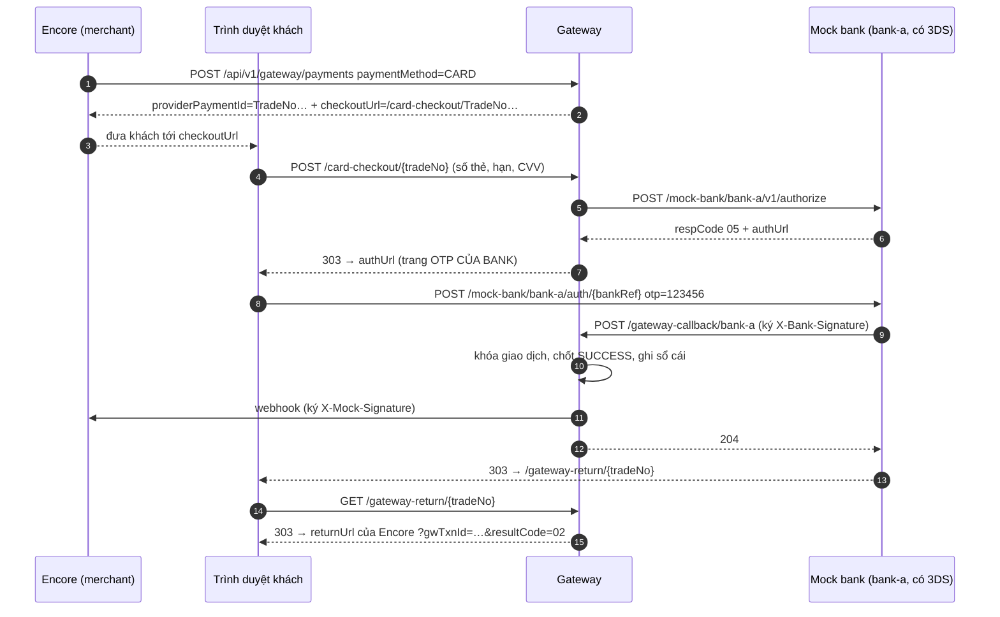
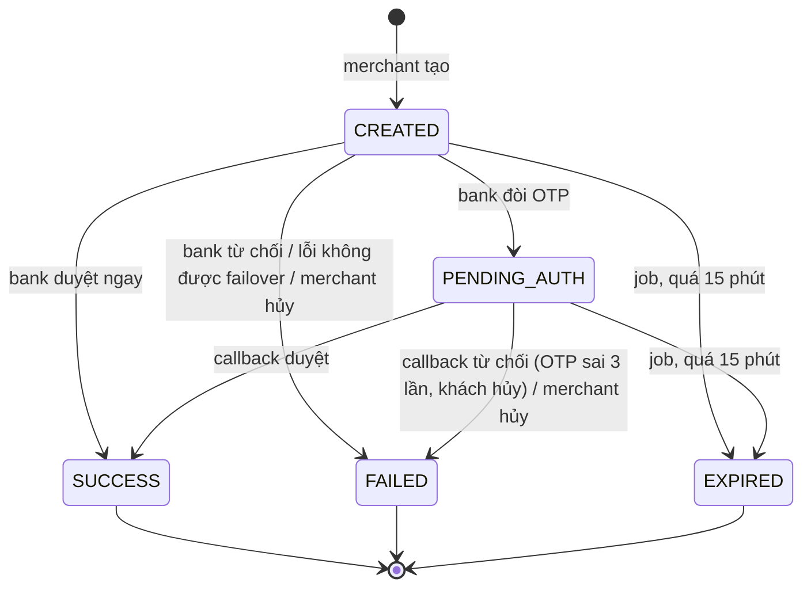

# Đọc code gateway & mock bank — cho người mới

Tài liệu này dẫn bạn đi qua code của `bankSimulate/` (cổng thanh toán mô phỏng) từ con số 0. Bạn chỉ cần đọc được
cú pháp Java. Mọi khái niệm thanh toán và Spring cần dùng đều được giải thích ngay chỗ nó xuất hiện.

Cách đọc gợi ý: đọc lần lượt từ mục 1 đến mục 9, mở file code tương ứng bên cạnh. Mục 13 có bài tập chạy thật để bạn
tận mắt thấy từng bước. Bản tóm tắt luồng ở mức cao hơn (ít code hơn) nằm ở `GATEWAY-BANK-FLOW.md` cùng thư mục.

> Đường dẫn file trong tài liệu tính từ `src/main/java/com/bankSimulate/`. Ví dụ `application/CardPaymentService.java`
> là `bankSimulate/src/main/java/com/bankSimulate/application/CardPaymentService.java`.

## Mục lục

1. [Thanh toán ngoài đời chạy thế nào](#1-thanh-toán-ngoài-đời-chạy-thế-nào)
2. [Spring tối thiểu để đọc code này](#2-spring-tối-thiểu-để-đọc-code-này)
3. [Bản đồ thư mục](#3-bản-đồ-thư-mục)
4. [Dữ liệu: các bảng và mã định danh](#4-dữ-liệu-các-bảng-và-mã-định-danh)
5. [Ai được gọi cửa nào: 4 kiểu xác thực](#5-ai-được-gọi-cửa-nào-4-kiểu-xác-thực)
6. [Admin dựng cấu hình: acquirer → routing → merchant → terminal](#6-admin-dựng-cấu-hình)
7. [Luồng thẻ, từng dòng code](#7-luồng-thẻ-từng-dòng-code)
8. [Luồng QR / ví](#8-luồng-qr--ví)
9. [Tiền đi đâu: sổ cái](#9-tiền-đi-đâu-sổ-cái)
10. [Hoàn tiền](#10-hoàn-tiền)
11. [Log: lần theo một giao dịch](#11-log-lần-theo-một-giao-dịch)
12. [Encore gọi gateway thế nào](#12-encore-gọi-gateway-thế-nào)
13. [Bài tập: tự chạy một giao dịch](#13-bài-tập-tự-chạy-một-giao-dịch)
14. [Bẫy và code cũ còn sót](#14-bẫy-và-code-cũ-còn-sót)
15. [Câu hỏi tự kiểm tra](#15-câu-hỏi-tự-kiểm-tra)

---

## 1. Thanh toán ngoài đời chạy thế nào

### 1.1 Câu chuyện ở quán cà phê

Bạn mua ly cà phê 50.000đ và quẹt thẻ Visa của Vietcombank vào máy POS của quán. Chuyện xảy ra phía sau:

1. **Máy POS** (terminal) gửi lệnh "trừ 50.000đ thẻ này" tới **công ty cung cấp máy** (gateway).
2. Gateway chuyển lệnh tới **ngân hàng ký hợp đồng nhận thẻ cho quán** (acquirer), ví dụ MB Bank.
3. MB Bank hỏi qua mạng thẻ tới **ngân hàng phát hành thẻ của bạn** (issuer), ở đây là Vietcombank: "thẻ này có đủ tiền không?"
4. Vietcombank có thể bắt bạn nhập **OTP** gửi về điện thoại. Bước này gọi là **3DS** (3-D Secure), dùng để chứng minh
   đúng chủ thẻ đang trả tiền.
5. Vietcombank trả lời **duyệt** hoặc **từ chối**. Câu trả lời đi ngược về máy POS.
6. Cuối ngày, tiền được chuyển vào **tài khoản nhận tiền** của quán. Bước này gọi là **settlement**.

### 1.2 Ánh xạ sang hệ thống này

| Ngoài đời | Trong dự án | Ghi chú |
|---|---|---|
| Quán cà phê | **Merchant** = một ban tổ chức (BTC) trên Encore | Mỗi BTC là một merchant riêng trên gateway |
| Máy POS | **Terminal** | Một merchant có thể có nhiều terminal; Encore dùng đúng một |
| Công ty cung cấp máy | **Gateway** = app `bankSimulate` (cổng 8090) | Phần lớn tài liệu này nói về nó |
| MB Bank (acquirer) | **Acquirer** = một dòng trong bảng `acquirers` (`bank-a`, `bank-b`, `QR_PROVIDER_A`…) | Chỉ là dữ liệu, không phải code |
| Vietcombank (issuer) | **Mock bank** = vài controller trong cùng app, dưới đường dẫn `/mock-bank/...` | Chỉ biết duyệt hoặc từ chối |
| Bạn | **Khách** mua vé trên Encore | |
| Hợp đồng quán ↔ MB Bank | **Acquirer Connection** (bảng `acquirer_merchant_configs`) | Có thì merchant mới được gửi lệnh qua acquirer đó |
| "Thẻ đi MB, MB lỗi thì đi Techcombank" | **Routing profile** + **routing rule** | Thứ tự ưu tiên các acquirer cho từng phương thức |

Mock bank đóng gộp hai vai **acquirer + issuer**. Gateway gửi lệnh tới nó như gửi tới acquirer, và nó tự quyết duyệt
hay từ chối như issuer. Không có mạng thẻ ở giữa.

### 1.3 Ai biết gì

Đây là quy tắc thiết kế quan trọng nhất của dự án. Code nào vi phạm quy tắc này là sai:

| Vai | Biết | Không biết |
|---|---|---|
| BTC (merchant) | Tài khoản ngân hàng nhận tiền của mình | Gateway, terminal, acquirer, routing |
| Khách | Chọn thẻ hoặc QR, nếu được bật | Mọi thứ phía sau |
| Encore | `merNo` + `terminalId` + secret của từng BTC | Acquirer, routing |
| Admin + gateway | Merchant, terminal, acquirer, routing, connection | — |
| Mock bank | Duyệt / từ chối (kiểu có 3DS thì hỏi OTP trước) | Danh sách bank, acquirer, merchant |

### 1.4 Hai luồng thanh toán

- **Thẻ**: gateway gọi HTTP sang mock bank. Mock bank trả về ngay (duyệt/từ chối), hoặc đòi OTP trước rồi gọi ngược lại
  gateway sau. Đây là luồng phức tạp nhất (mục 7).
- **QR / ví** (QR, PayNow, Google Pay, Apple Pay): gateway hiện một trang có mã QR. Khách bấm "Xác nhận thanh toán"
  trên trang đó, tức là đóng vai "app ngân hàng của khách đã duyệt". Không có cuộc gọi HTTP nào sang mock bank (mục 8).

---

## 2. Spring tối thiểu để đọc code này

Bạn không cần biết hết Spring. Code này chỉ dùng chừng này thứ.

### 2.1 Bean và tiêm phụ thuộc (dependency injection)

```java
@Service
public class CardPaymentService {
    private final CardBankRouter router;

    public CardPaymentService(..., CardBankRouter router, ...) {
        this.router = router;
    }
}
```

- `@Service`, `@Component`, `@RestController`, `@Configuration` đánh dấu một class là **bean**. Lúc khởi động, Spring
  tự tạo **một** object của class đó.
- Constructor khai tham số kiểu nào thì Spring đưa đúng bean kiểu đó vào. Bạn không bao giờ thấy `new CardBankRouter()`
  trong code: Spring tự lắp.
- Mẹo hay dùng ở đây: khai tham số là **`List<Interface>`** thì Spring đưa vào **mọi** bean cài interface đó.
  `CardBankRouter` nhận `List<CardAuthorizationPort> ports`, và nhận được cả `ThreeDsAcquirerClient` lẫn
  `DirectAcquirerClient`.

### 2.2 Controller: nhận HTTP

```java
@RestController
@RequestMapping("/api/v1/gateway")
public class GatewayRuntimeController {
    @PostMapping("/payments")
    public PaymentResponse createPayment(@RequestHeader("X-Merchant-No") String merNo,
                                         @Valid @RequestBody CreatePaymentRequest request) { ... }
}
```

- `@PostMapping("/payments")` cộng với `@RequestMapping` ở class cho ra đường dẫn `POST /api/v1/gateway/payments`.
- `@RequestHeader` đọc header, `@PathVariable` đọc `{id}` trên URL, `@RequestParam` đọc `?x=` hoặc field của form HTML.
- `@RequestBody` đổi JSON trong body thành object Java. `@Valid` kiểm các chú thích như `@NotBlank`, `@Positive`
  trên record; sai thì trả 400.
- Hàm trả về object thì Spring tự đổi sang JSON. Trả `String` kèm `produces = TEXT_HTML_VALUE` thì đó là một trang
  HTML. Các trang checkout và trang OTP đều được dựng kiểu này, bằng chuỗi HTML trong code Java.

### 2.3 `record`: hộp chứa dữ liệu

```java
public record CardRoute(String acquirerCode, CardAuthorizationPort port) {}
```

`record` là class chỉ để chứa dữ liệu, không sửa được sau khi tạo. Java tự sinh constructor và hàm đọc
`route.acquirerCode()` (không có `get`). Mọi DTO (dữ liệu đi qua API) trong `infrastructure/web/dto/` đều là record.

### 2.4 Entity + Repository: đọc/ghi DB bằng JPA

```java
@Entity
@Table(name = "gateway_transactions")
public class GatewayTransaction { @Id private UUID id; ... }

public interface GatewayTransactionRepository extends JpaRepository<GatewayTransaction, UUID> {
    Optional<GatewayTransaction> findByGwTxnId(String gwTxnId);

    @Lock(LockModeType.PESSIMISTIC_WRITE)
    Optional<GatewayTransaction> findWithLockByGwTxnId(String gwTxnId);
}
```

- Một **entity** ứng với một bảng, mỗi field ứng với một cột.
- **Repository** là interface **không có code**. Spring đọc **tên hàm** rồi tự sinh SQL:
  `findByGwTxnId` thành `SELECT ... WHERE gw_txn_id = ?`.
- `@Lock(PESSIMISTIC_WRITE)` thêm `FOR UPDATE` vào câu SQL, tức là **khóa dòng đó**. Ai khác muốn khóa cùng dòng phải
  đợi tới khi transaction hiện tại xong. Dự án đặt tên các hàm này là `findWithLock...` để nhìn tên là biết có khóa.
- Sửa field của một entity đọc ra **bên trong** transaction thì lúc commit, JPA tự `UPDATE`. Không cần gọi `save()`.

Ngoài JPA, `GatewayMoneyService` dùng **`JdbcTemplate`**: viết SQL tay. Lý do là phần sổ sách cần nhiều câu
`UPDATE ... WHERE balance >= ?` có điều kiện, viết SQL thẳng dễ đọc hơn.

### 2.5 Transaction: `@Transactional` và `TransactionTemplate`

**Transaction** là một nhóm câu SQL hoặc thành công hết, hoặc bị hủy hết (rollback). Ví dụ "trừ tiền khách" và "cộng
tiền merchant" phải đi cùng nhau.

Code này dùng hai cách mở transaction:

```java
// Cách 1: chú thích. Cả hàm là một transaction.
@Transactional
public void markPaid(...) { ... }

// Cách 2: TransactionTemplate. Chỉ đoạn trong lambda là transaction.
tx.executeWithoutResult(status -> {
    GatewayTransaction txn = transactions.findWithLockByGwTxnId(id).orElseThrow();
    txn.recordCard(brand, masked);
});
```

Vì sao `CardPaymentService` dùng cách 2:

1. **Không được giữ transaction trong lúc gọi HTTP sang bank.** Gọi bank có thể mất tới 20 giây (read timeout). Giữ
   transaction là giữ khóa dòng suốt 20 giây đó: callback của bank hay job dọn dẹp muốn sửa cùng giao dịch sẽ bị kẹt.
   Vì vậy code chia làm ba nhịp: **khóa + ghi (TX ngắn) → gọi bank (ngoài TX) → khóa + ghi kết quả (TX ngắn)**.
2. `@Transactional` chỉ có tác dụng khi hàm được gọi **từ bean khác**. Gọi hàm trong cùng class thì Spring không chen
   vào được, và transaction lặng lẽ không mở. `TransactionTemplate` là lời gọi trực tiếp nên luôn chạy đúng.

Khi một hàm `@Transactional` (vd `money.markPaid`) được gọi **bên trong** `tx.execute(...)`, nó **nhập vào**
transaction đang mở chứ không mở cái mới. Vì vậy bảng thẻ và bảng sổ cái luôn được ghi cùng nhau.

### 2.6 Còn lại

| Thứ | Ở đâu | Làm gì |
|---|---|---|
| `@Value("${gateway.public-base-url:http://localhost:8090}")` | nhiều constructor | Đọc cấu hình trong `application.yaml`; phần sau dấu `:` là giá trị mặc định |
| `@Scheduled(fixedDelayString = ...)` | `CardTransactionExpiryJob` | Chạy hàm định kỳ |
| `OncePerRequestFilter` | `RequestIdFilter`, `AdminKeyFilter` | Chạy trước mọi request, trước cả controller |
| `@ExceptionHandler` | `ApiExceptionHandler` | Bắt exception ném ra từ bất kỳ đâu, đổi thành response lỗi JSON |
| Flyway | `resources/db/migration/V*.sql` | Tự chạy file SQL theo số thứ tự lúc khởi động để dựng/sửa bảng |
| MDC | `GatewayLogContext` | "Túi" thông tin gắn vào mọi dòng log của request hiện tại (mục 11) |

---

## 3. Bản đồ thư mục

```
com/bankSimulate/
├── domain/                 Dữ liệu + quy tắc thuần, không gọi DB hay HTTP
│   ├── acquirer/           Acquirer (method nhận được, có 3DS?), AcquirerMerchantConfig (= Acquirer Connection)
│   ├── merchant/           Merchant, MerchantCredential (secret đã mã hóa)
│   ├── terminal/           Terminal, TerminalPaymentMethod (method đã tick)
│   ├── routing/            RoutingProfile, RoutingRule
│   ├── gateway/            GatewayTransaction (giao dịch thẻ) + GatewayTransactionEvent (lịch sử đổi trạng thái)
│   ├── cardAuth/           "Hợp đồng" gửi lệnh thẻ: CardAuthorizationPort, Command, Result, BankFailure
│   ├── bank/               Phía CHI tiền (hoàn tiền): BankProcessor, BankProfile
│   ├── enums/              PaymentMethod, Status, ThreeDsPolicy, ThreeDsPreference, GateWayTransactionStatus…
│   └── common/             ApiException (lỗi có mã), ResultCode (01…05)
├── application/            Nghiệp vụ (các @Service)
│   ├── GatewayRuntimeAuth      Xác thực merchant (bộ ba header)
│   ├── GatewayRuntimeService   Cửa POST /payments chung: đọc paymentMethod rồi chuyển cho đúng luồng
│   ├── CardPaymentService      Toàn bộ luồng thẻ
│   ├── QrPaymentService        Toàn bộ luồng QR/ví (trang /checkout, trạng thái trong payment_transactions)
│   ├── RefundPayoutService     Hoàn tiền: chi từ ví chi của gateway, lưu refund_transactions
│   ├── CardBankRouter          Chọn acquirer cho thẻ + chọn kiểu giao thức
│   ├── GatewayMoneyService     Sổ cái: payment_transactions, trừ/cộng tiền, settlement
│   ├── TerminalService / RoutingService / AcquirerService / MerchantService   Các API admin
│   └── MerchantOnboardingService   Dựng trọn merchant bằng một request (Encore gọi)
├── infrastructure/
│   ├── web/                Controller + dto/
│   ├── bank/               HTTP client gửi lệnh thẻ sang mock bank + dịch lỗi mạng
│   ├── notify/             MerchantWebhookSender: báo kết quả thẻ cho merchant
│   ├── security/           AdminKeyFilter, SecretCipher (AES), CallbackSigner (HMAC)
│   ├── persistence/        Repository
│   ├── scheduling/         CardTransactionExpiryJob
│   └── logging/            RequestIdFilter, GatewayLogContext, tiền tố log
├── mockbank/               "Hệ thống của ngân hàng". Gateway chỉ được gọi nó qua HTTP
│   ├── ThreeDsMockBank         Bank có 3DS: quyết định + giữ phiên OTP
│   ├── DirectMockBank          Bank không 3DS: quyết định ngay
│   └── web/                    MockBankAController (API kiểu 3DS), MockBankBController (API kiểu trả thẳng)
└── config/                 DevelopmentSeed (dữ liệu mẫu), BankProfileConfiguration (bank chi tiền tới được)
```

`mockbank/` nằm chung app với gateway cho tiện chạy, nhưng hãy coi nó là **một hệ thống khác**. Gateway không bao giờ
gọi thẳng class trong `mockbank/`. Nó gọi qua HTTP, đúng như gọi một ngân hàng thật. Vì vậy hai bên có bộ từ vựng
riêng: gateway nói `ThreeDsPreference.REQUEST_CHALLENGE`, mock bank nói `AuthPreference.CHALLENGE`.

---

## 4. Dữ liệu: các bảng và mã định danh

### 4.1 Mã định danh

| Mã | Ví dụ | Ai cấp | Sinh ở đâu |
|---|---|---|---|
| `merNo` | `MerNo000012` | gateway | `MerchantService.create` |
| `terminalId` | `TerNo000015` | gateway | `TerminalService.create` |
| `tradeNo` (cũng gọi là `gwTxnId`, `providerPaymentId`) | `TradeNo000123` | gateway, dùng chung cho thẻ, QR và refund | `GatewayTransactionRepository.nextTradeNo()` (sequence `trade_number_seq`) |
| `orderCode` | `1001` | merchant tự đặt (mã đơn bên Encore) | — |
| `bankRef` | `TDS-1A2B3C4D5E6F`, `DIR-…` | mock bank | `ThreeDsMockBank` / `DirectMockBank` |
| merchant secret | `gwsec_…` | gateway | `MerchantService.newSecret()` |

Cùng một giao dịch có ba tên trong code: `tradeNo`, `gwTxnId` (luồng thẻ) và `providerPaymentId` (luồng QR, và phía
Encore). Ba tên đó là **một giá trị**.

Số `tradeNo` có thể **nhảy cóc**: luồng QR lấy số từ sequence **trước** khi kiểm `items`, nên request bị từ chối (vd sai
tổng tiền) vẫn tiêu mất một số. Sequence của PostgreSQL không bao giờ trả số lại.

### 4.2 Ba nhóm bảng

**Cấu hình**: admin dựng, ít khi đổi (`V1`, `V2`, `V8`, `V12`)

| Bảng | Một dòng là |
|---|---|
| `merchants` | Một merchant. Có `settlement_bank_bin/_account_number/_account_name` = tài khoản nhận tiền, `external_reference` = nhãn nối về Encore (`ENCORE_ORGANIZER_<uuid>`) |
| `merchant_credentials` | Một phiên bản secret. Chỉ **một** dòng `ACTIVE` mỗi merchant (unique index). Secret lưu **đã mã hóa** |
| `terminals` | Một terminal: `three_ds_policy`, `routing_profile_id`, `status` |
| `terminal_payment_methods` | "Terminal X đã tick method Y" |
| `acquirers` + `acquirer_payment_methods` | Một acquirer, có hỗ trợ 3DS không (`three_ds_supported`), và nhận những method nào |
| `acquirer_merchant_configs` | Acquirer Connection: merchant X được gửi lệnh qua acquirer Y (kèm MID/TID) |
| `routing_profiles` + `routing_rules` | "Profile P: method M thì đi acquirer A, ưu tiên 1" |

**Giao dịch** (`V3`, `V6`, `V10`)

| Bảng | Một dòng là |
|---|---|
| `payment_transactions` | **Bảng chính** cho MỌI giao dịch (thẻ, QR, ví): số tiền, trạng thái, tài khoản settlement chụp lúc tạo |
| `payment_attempts` | Lần gửi lệnh tới acquirer (hiện mỗi giao dịch có 1 dòng) |
| `transaction_events` | Lịch sử đổi trạng thái của `payment_transactions` |
| `gateway_transactions` | **Chỉ thẻ**: chi tiết ủy quyền (bank nào, `bank_ref`, thẻ đã che, `result_code`) |
| `gateway_transaction_events` | Lịch sử đổi trạng thái của giao dịch thẻ, kèm **ai** gây ra (MERCHANT/GATEWAY/BANK/JOB) |

Vì sao thẻ có thêm bảng riêng: khi bank gọi lại sau bước OTP, nó chỉ gửi `bank_ref` cùng kết quả. Gateway phải từ đó
tra ra merchant nào, đơn nào, gửi webhook đi đâu. Comment trong `V6__gateway_card_transactions.sql` giải thích kỹ.

**Tiền** (`V3`, `V4`)

| Bảng | Một dòng là |
|---|---|
| `issuer_accounts` | Tài khoản ngân hàng của "khách mô phỏng". Có sẵn `SANDBOX_BUYER` với 100.000.000đ (`V4`) |
| `issuer_holds` | Khoản tiền đang tạm giữ / đã trừ của một giao dịch QR |
| `sandbox_ledger_entries` | **Sổ cái kép**: mỗi bút toán là (giao dịch, giai đoạn, tài khoản, số tiền ±) |
| `sandbox_merchant_accounts` | Số dư tài khoản nhận tiền của merchant sau settlement |

Bảng `refund_transactions` (`V3`, bổ sung ở `V13`) lưu lệnh hoàn tiền, xem mục 10.

Các bảng tồn tại nhưng **không code nào dùng**: `webhook_deliveries`, cột
`payment_transactions.request_payload`. Đừng tìm logic của chúng.

---

## 5. Ai được gọi cửa nào: 4 kiểu xác thực

| Cửa | Ai gọi | Bảo vệ bằng | Code |
|---|---|---|---|
| `/api/v1/admin/**` | Admin (qua Encore) | Header `X-Admin-Key` khớp `gateway.admin-key` | `security/AdminKeyFilter` |
| `/api/v1/gateway/**` | Merchant (Encore) | Bộ ba `X-Merchant-No` + `X-Terminal-Id` + `X-Merchant-Secret` | `application/GatewayRuntimeAuth` |
| `/gateway-callback/{bank}` | Mock bank | Header `X-Bank-Signature` = HMAC của body | `security/CallbackSigner` |
| Webhook gateway → merchant | Gateway gửi đi | Header `X-Mock-Signature` = HMAC của body bằng secret của merchant | `notify/MerchantWebhookSender` (`send` cho thẻ, `sendQr` cho QR/ví) |

Các trang cho trình duyệt (`/checkout/**`, `/card-checkout/**`, `/mock-bank/{bank}/auth/**`, `/gateway-return/**`)
không cần xác thực: ai có link là mở được. Đúng như link thanh toán thật.

### 5.1 Xác thực merchant từng bước

`GatewayRuntimeAuth.authenticate(merNo, terminalId, secret)`:

1. Tìm merchant theo `merNo`. Không có thì 404. Đang tắt thì 409 `MERCHANT_INACTIVE`.
2. Tìm terminal. Terminal phải **thuộc merchant đó** (403 `TERMINAL_NOT_OWNED`) và đang bật (409 `TERMINAL_INACTIVE`).
3. Lấy credential `ACTIVE`, **giải mã** secret bằng `SecretCipher`, so với secret client gửi lên.
4. Khớp thì trả `Access(merchant, terminal, secret)`. Mọi hàm nghiệp vụ phía sau nhận `Access` này.

Hai chi tiết bảo mật đáng học:

- **So sánh bằng `MessageDigest.isEqual`, không bằng `String.equals`.** `equals` dừng ở ký tự sai đầu tiên, nên thời gian
  trả lời để lộ "đúng được mấy ký tự đầu". Kẻ tấn công đo thời gian là đoán dần được secret. `isEqual` luôn so hết.
  `AdminKeyFilter` và `CallbackSigner.matches` cũng làm vậy.
- **Secret lưu đã mã hóa (AES-GCM).** Khóa = SHA-256 của `gateway.master-key`. Lộ DB mà không lộ master key thì vẫn không
  đọc được secret. Định dạng lưu là `base64(iv):base64(ciphertext)`.

### 5.2 HMAC là gì

HMAC-SHA256(body, secret) cho ra một chuỗi hex. Chỉ ai có secret mới tạo được đúng chuỗi đó cho đúng body. Bên nhận tự
tính lại và so sánh. Khớp thì chứng minh được hai điều: (1) người gửi có secret, (2) body không bị sửa dọc đường.
Vì vậy `BankCallbackController` nhận body dạng **chuỗi thô** (`@RequestBody String rawBody`), kiểm chữ ký, rồi mới parse
JSON. Parse rồi serialize lại thì thứ tự field hay khoảng trắng có thể khác, và chữ ký không còn khớp.

---

## 6. Admin dựng cấu hình

Trước khi có giao dịch nào, phải có đủ 5 thứ. Thiếu một thứ là giao dịch bị từ chối với một mã lỗi cụ thể.

```
Acquirer ──(nhận CARD? QR? có 3DS?)
   ▲
RoutingRule (method, priority) ── thuộc ──> RoutingProfile ◄── Terminal (methods đã tick, 3DS policy)
   │                                                              │
   └── Merchant phải có Acquirer Connection tới acquirer đó ──── Merchant
```

### 6.1 Acquirer là dữ liệu

`domain/acquirer/Acquirer.java`:

```java
/** Acquirer ACTIVE và nhận method này. Thiếu một trong hai thì routing bỏ qua nó. */
public boolean accepts(PaymentMethod method) {
    return status == Status.ACTIVE && paymentMethods.contains(method);
}

/** Terminal bắt buộc 3DS thì giao dịch THẺ chỉ được đi qua acquirer có 3DS. */
public boolean meetsThreeDs(PaymentMethod method, ThreeDsPolicy policy) {
    return method != PaymentMethod.CARD || policy != ThreeDsPolicy.REQUIRED || threeDsSupported;
}
```

Thêm một ngân hàng mới = thêm một dòng dữ liệu (`POST /api/v1/admin/acquirers`), **không cần viết class mới**. Cờ
`threeDsSupported` quyết định gateway nói chuyện với acquirer đó theo giao thức nào (mục 7.4).

### 6.2 Quy tắc "route dùng được"

Một rule (method M → acquirer A) dùng được cho merchant X trên terminal T khi:

1. `A.accepts(M)`: A đang bật và nhận M.
2. `A.meetsThreeDs(M, T.threeDsPolicy)`: nếu là thẻ và T bắt buộc 3DS thì A phải có 3DS.
3. X có Acquirer Connection `ACTIVE` tới A.

Quy tắc này xuất hiện ở **4 chỗ**, và cả 4 phải giống nhau:

| Chỗ | Làm gì |
|---|---|
| `TerminalService.checkRoute` / `validateRoutes` | Chặn **lưu** terminal tick method mà không có route dùng được |
| `TerminalService.routableMethods` | Trả về method khách **thật sự trả được lúc này** |
| `CardBankRouter.resolveAll` | Chọn acquirer lúc **thanh toán thẻ** |
| `QrPaymentService.resolveRoute` | Chọn acquirer lúc **tạo giao dịch QR/ví** |

Vì sao phải giống nhau: nếu chỗ lưu cấu hình dễ hơn chỗ chạy thật, admin lưu được một cấu hình mà khách bấm vào là
hỏng. Ngược lại, nếu chỗ lưu khó hơn, admin bị chặn oan.

**"Tick" không có nghĩa là "trả được".** Admin có thể tắt acquirer **sau khi** đã lưu terminal. Terminal vẫn tick QR
nhưng không còn route QR nào dùng được. Vì vậy `GET /api/v1/gateway/terminal` trả `paymentMethods` = `routableMethods`
(trả được), còn `configuredPaymentMethods` = đã tick. Encore chỉ hiện cho khách danh sách đầu.

### 6.3 Lưu terminal: kiểm trên trạng thái cuối cùng

`TerminalService.configure` nhận methods + 3DS + routing profile trong **một** request và kiểm trên **kết quả cuối**.
Ba endpoint rời (`/payment-methods`, `/three-ds-policy`, `/routing-profile`) vẫn còn, nhưng gọi theo thứ tự nào cũng có
trường hợp hỏng. Ví dụ muốn "thêm QR + đổi sang profile có rule QR": lưu methods trước thì bị kiểm theo profile **cũ**
(chưa có rule QR) và bị từ chối. Comment trong code liệt kê đủ các trường hợp.

Thứ tự báo lỗi trong `validateRoutes` là thứ tự "sửa được ngay":

1. `ROUTING_NOT_CONFIGURED`: profile không có rule cho method này.
2. `ACQUIRER_NOT_CONFIGURED`: có acquirer phù hợp, chỉ thiếu Acquirer Connection (lỗi nêu tên acquirer).
3. `ACQUIRER_3DS_NOT_SUPPORTED`: 3DS `REQUIRED` mà route thẻ chỉ tới acquirer không có 3DS.
4. `ACQUIRER_METHOD_NOT_SUPPORTED`: acquirer của route đang tắt hoặc không nhận method.

Còn một luật nhỏ ở `ConfigParsers.cardPolicy`: 3DS chỉ có nghĩa với thẻ. Terminal không tick CARD mà đặt 3DS khác
`DISABLED`/null là 400 `CARD_NOT_ENABLED`.

### 6.4 Onboarding: dựng merchant bằng một request

Encore gọi `POST /api/v1/admin/merchant-onboarding` ngay khi một BTC được tạo. `MerchantOnboardingService.onboard`
làm trong **một transaction**:

1. `MerchantService.create`: tạo merchant (`MerNo…`) và một secret mới (lưu bản mã hóa, trả bản gốc **một lần duy nhất**).
2. Có tài khoản nhận tiền trong request thì `updateSettlement`.
3. Tạo Acquirer Connection tới các acquirer mặc định (`gateway.defaults.acquirers` = `bank-a,bank-b,QR_PROVIDER_A`).
4. `TerminalService.create`: tạo terminal với methods `CARD,QR`, 3DS `OPTIONAL`, profile `STANDARD`.

Profile `STANDARD` và 3 acquirer kia do `config/DevelopmentSeed` tạo khi `GATEWAY_SEED_ENABLED=true`. Tắt seed trên DB
mới thì onboarding lỗi 404 vì không tìm thấy chúng.

| Seed tạo | Nhận | 3DS |
|---|---|---|
| `bank-a` | CARD | có |
| `bank-b` | CARD | không |
| `QR_PROVIDER_A` | QR | không |
| `ACQUIRER_A`, `ACQUIRER_B` | CARD, PAYNOW, GOOGLE_PAY, APPLE_PAY | có |

| Profile | Rule |
|---|---|
| `CARD_VIA_BANK_A` | CARD → bank-a |
| `CARD_VIA_BANK_B` | CARD → bank-b |
| `STANDARD` | CARD → bank-a (1), bank-b (2); QR → QR_PROVIDER_A (1) |

---

## 7. Luồng thẻ, từng dòng code

Đây là phần dài nhất. Theo dõi một giao dịch thẻ từ lúc Encore tạo tới lúc Encore nhận webhook.

### 7.1 Toàn cảnh (bank có 3DS, thẻ bị hỏi OTP)



Với bank **không** 3DS (hoặc bank 3DS duyệt luôn), các bước 6–12 gộp lại thành: bank trả duyệt/từ chối ngay, gateway
chốt, gửi webhook, rồi đưa khách thẳng về `/gateway-return/…`.

Hai con đường báo kết quả cần phân biệt:

- **Callback server-to-server** (bước 9, rồi webhook ở bước 11) là **đường tin cậy**. Đơn hàng được chốt theo đường này.
- **Redirect trình duyệt** (bước 13–16) chỉ để khách **thấy** kết quả. Khách đóng tab giữa chừng thì đường này mất,
  nhưng giao dịch vẫn được chốt đúng. Đừng bao giờ chốt đơn dựa vào việc trình duyệt quay về.

### 7.2 Bước 1: một cửa cho mọi phương thức

`GatewayRuntimeController.createPayment` xác thực merchant rồi gọi `GatewayRuntimeService.createPayment`. Service này
**chỉ làm cửa vào**, không xử lý thanh toán:

```java
PaymentMethod selected = parseMethod(request.paymentMethod());          // null/rỗng → CARD
if (!methods.existsByTerminalIdAndPaymentMethod(access.terminal().getId(), selected))
    throw new ApiException(409, "PAYMENT_METHOD_NOT_ENABLED", ...);      // terminal chưa tick method này
money.findByOrder(merchantId, terminalId, orderCode)                     // orderCode đã dùng cho method KHÁC?
        .filter(existing -> !existing.paymentMethod().equals(selected.name()))
        .ifPresent(existing -> { throw new ApiException(409, "ORDER_CODE_ALREADY_USED", ...); });
return selected == PaymentMethod.CARD
        ? cards.createFromPayments(access, request)                     // mục 7
        : qr.create(access, request, selected);                          // mục 8
```

Merchant chỉ cần biết một endpoint và nói "trả bằng gì" qua field `paymentMethod`. Gateway tự rẽ: `CARD` sang
`CardPaymentService`, `QR`/`PAYNOW`/`GOOGLE_PAY`/`APPLE_PAY` sang `QrPaymentService`. Hỏi trạng thái
(`GET /payments/{tradeNo}`) và hủy cũng một cửa: `cards.exists(tradeNo)` thì là giao dịch thẻ, không thì là QR/ví.

Chặn trùng `orderCode` khác phương thức nằm ở cửa vào vì ràng buộc `UNIQUE (merchant_id, terminal_id, order_code)` của
`payment_transactions` là của chung hai luồng. Trùng cùng phương thức thì để từng luồng tự trả lại giao dịch cũ.

### 7.3 Bước 2: tạo giao dịch thẻ — `CardPaymentService.create`

```java
// Tạo lại cùng orderCode: trả về giao dịch cũ, không gọi bank lần nữa.
var existing = transactions.findByMerchantIdAndTerminalIdAndOrderCode(...);
if (existing.isPresent()) return response(existing.get(), null);

CardBankRouter.CardRoute bank = router.resolve(access.merchant(), access.terminal());   // acquirer ưu tiên 1
String gwTxnId = transactions.nextTradeNo();

tx.executeWithoutResult(status -> {
    GatewayTransaction created = new GatewayTransaction(gwTxnId, ..., bank.acquirerCode(),
            ThreeDsPreference.from(access.terminal().getThreeDsPolicy()), ..., Instant.now().plus(authTtl));
    transactions.save(created);
    record(created, null, Actor.MERCHANT, "Created for bank ...");
});

if (!request.hasCard())
    return new CreateResponse(gwTxnId, ..., publicBaseUrl + "/card-checkout/" + gwTxnId, ...);
```

Cần để ý mấy điểm:

- **Idempotent theo `orderCode`.** Encore gửi lại cùng một đơn (do mạng chập chờn, do retry) thì nhận về **đúng giao
  dịch cũ**. DB còn có ràng buộc `UNIQUE (merchant_id, terminal_id, order_code)` làm lưới an toàn.
- **Chụp chính sách 3DS ngay lúc tạo** (`threeDsPreference`): admin đổi terminal sau đó không ảnh hưởng giao dịch
  đang dở.
- `authTtl` mặc định 15 phút (`gateway.card.auth-ttl`). Quá hạn thì job dọn (mục 7.9).
- `record(...)` ghi một dòng `gateway_transaction_events`, đồng thời gọi `syncPaymentRecord`. Ở trạng thái `CREATED`
  hàm này gọi `money.register(...)` để tạo dòng trong bảng chính `payment_transactions`. **Hai bảng luôn được ghi trong
  cùng transaction.**
- Encore **không gửi số thẻ**: request không có thẻ thì gateway trả `checkoutUrl` = trang nhập thẻ **của gateway**.
  Nhờ vậy số thẻ không bao giờ chạm vào server Encore, và Encore nằm ngoài phạm vi chuẩn bảo mật thẻ PCI DSS. Endpoint
  `POST /api/v1/gateway/card-payments` (`CardPaymentController`) cho phép gửi thẻ thẳng, dành cho merchant đã có chứng
  nhận PCI. Encore không dùng endpoint này.

### 7.4 Bước 3: chọn acquirer và giao thức — `CardBankRouter`

```java
public record CardRoute(String acquirerCode, CardAuthorizationPort port) {}

public List<CardRoute> resolveAll(Merchant merchant, Terminal terminal) {
    // ... lấy profile của terminal, phải ACTIVE
    var candidates = rules.findAll...OrderByPriorityAsc(profile.getId(), PaymentMethod.CARD);
    for (var rule : candidates) {
        Acquirer acquirer = acquirers.findById(rule.getAcquirerId()).orElse(null);
        if (acquirer == null || !acquirer.accepts(CARD) || !acquirer.meetsThreeDs(CARD, terminal.getThreeDsPolicy())) continue;
        if (!acquirerConfigs.existsBy...(acquirer.getId(), merchant.getId(), ACTIVE)) continue;
        usable.add(route(acquirer));
    }
    // ...
}

private CardRoute route(Acquirer acquirer) {
    return new CardRoute(acquirer.getCode(), acquirer.isThreeDsSupported() ? threeDsPort : directPort);
}
```

Kết quả là **danh sách** acquirer theo thứ tự ưu tiên, mỗi cái kèm một **port** (kiểu giao thức):

- `ThreeDsAcquirerClient`: dành cho acquirer có 3DS. Bank có thể trả "cần OTP" kèm link.
- `DirectAcquirerClient`: dành cho acquirer không 3DS. Bank trả duyệt/từ chối ngay.

Cả hai cài cùng interface `CardAuthorizationPort`. Code gọi chỉ cần `bank.port().authorize(...)` mà không cần biết
đang nói chuyện với kiểu nào. Đây là ví dụ kinh điển của **đa hình (polymorphism)**.

Vì sao trả cả danh sách chứ không chỉ một: để **failover**, tức thử acquirer kế tiếp khi acquirer đầu không liên lạc
được (mục 7.8).

### 7.5 Bước 4: khách nhập thẻ — `CardCheckoutController` + `CardPaymentService.submitCard`

`GET /card-checkout/{tradeNo}` trả trang HTML có form nhập thẻ. Khách bấm "Thanh toán" thì form gửi
`POST /card-checkout/{tradeNo}`:

1. Controller kiểm định dạng: số thẻ 13–19 chữ số, CVV 3–4 số, tháng 1–12. Sai thì hiện lại trang kèm lỗi.
2. `submitCard` kiểm giao dịch còn ở `CREATED` (đã nộp thẻ rồi thì 409 `CARD_ALREADY_SUBMITTED`) và chưa hết hạn.
3. Gọi `authorizeWithBank(...)`, nhận về `redirectUrl`.
4. Controller trả **303 See Other** với header `Location`. Trình duyệt tự đi tới đó: trang OTP của bank (nếu cần
   OTP), hoặc `/gateway-return/{tradeNo}`.

Số thẻ chỉ **đi qua**. Gateway lưu đúng 6 số đầu + 4 số cuối (`CardPaymentService.mask`) và hãng thẻ (`cardBrand`:
đầu 4 là VISA, đầu 5 là MASTERCARD). CVV không bao giờ được lưu.

### 7.6 Bước 5: gọi bank — `CardPaymentService.authorizeWithBank`

Đây là hàm quan trọng nhất của luồng thẻ. Rút gọn:

```java
private String authorizeWithBank(String gwTxnId, String pan, int expiryMonth, int expiryYear, String cvv) {
    GatewayTransaction snapshot = require(gwTxnId);
    List<CardRoute> chain = failoverChain(merchant, terminal, snapshot.getBankCode());

    // (a) TX ngắn: ghi thẻ đã che
    tx.executeWithoutResult(s -> transactions.findWithLockByGwTxnId(gwTxnId).orElseThrow().recordCard(...));

    CardAuthorizationResult answered = null;
    for (int i = 0; i < chain.size(); i++) {
        CardRoute bank = chain.get(i);
        useBank(gwTxnId, bank.acquirerCode());            // (b) TX ngắn: ghi "đang thử bank này"
        try {
            answered = bank.port().authorize(...);         // (c) HTTP sang bank — NGOÀI transaction
            break;                                         // bank đã trả lời (kể cả TỪ CHỐI) → dừng
        } catch (ApiException failure) {
            if (!BankFailure.canTryAnotherBank(failure.getCode())) {
                failNow(gwTxnId, failure.getMessage());    // lệnh có thể đã tới bank → chốt FAILED, KHÔNG thử bank khác
                throw failure;
            }
            noteFailover(...);                             // chưa tới bank → ghi lại, thử bank kế tiếp
        }
    }
    if (answered == null) { failNow(...); throw new ApiException(502, "ALL_CARD_BANKS_UNAVAILABLE", ...); }

    // (d) TX ngắn: khóa giao dịch, ghi kết quả
    Notification notification = tx.execute(s -> {
        GatewayTransaction txn = transactions.findWithLockByGwTxnId(gwTxnId).orElseThrow();
        return switch (result.outcome()) {
            case APPROVED -> apply(txn, ResultCode.SUCCESS, ...);
            case DECLINED -> apply(txn, ResultCode.FAILED, ...);
            case REDIRECT_REQUIRED -> { txn.awaitAuthentication(result.bankRef()); ...; yield null; }
        };
    });
    deliver(notification);                                 // (e) webhook SAU khi đã commit
    return result.redirectUrl();
}
```

Đọc kỹ nhịp (a)→(e): mỗi lần sửa DB là một transaction ngắn có khóa dòng, còn HTTP luôn nằm **giữa** các
transaction. Lý do ở mục 2.5.

Vì sao webhook gửi **sau** commit (bước e): nếu gửi webhook "đã thanh toán" bên trong transaction rồi transaction lỗi
và rollback, merchant đã giao vé trong khi DB của gateway nói chưa thanh toán. Gửi sau commit thì chỉ báo những gì đã
thật sự được ghi.

Vì sao `useBank` (bước b) phải ghi **trước** khi gọi: callback 3DS về sau sẽ tra giao dịch bằng cặp
**(bank, bankRef)**. Nếu đã failover sang bank-b mà DB vẫn ghi bank-a thì callback của bank-b không tìm thấy giao dịch.

### 7.7 Bước 6: bên trong mock bank

**Phía gateway gửi gì.** Hai client nói hai "phương ngữ" khác nhau, giống như hai ngân hàng thật có API khác nhau:

| | `ThreeDsAcquirerClient` | `DirectAcquirerClient` |
|---|---|---|
| Endpoint | `POST /mock-bank/{bank}/v1/authorize` | `POST /mock-bank/{bank}/payment/authorize` |
| Số tiền | chuỗi `"200000"` | số `200000` |
| Tiền tệ | mã số `"704"` (= VND) | `"VND"` |
| Thẻ | object lồng `card{number, expiry "MM/YY", cvv}` | field phẳng `pan, expMonth, expYear, cvv` |
| Trả về | `respCode`: `00` duyệt · `05` cần OTP (kèm `authUrl`) · `99` từ chối | `status`: `APPROVED` / `DECLINED` |
| DTO | `mockbank/web/dto/MockBankADtos` | `mockbank/web/dto/MockBankBDtos` |

`{bank}` trên URL **chỉ là nhãn** (mã acquirer, vd `bank-a`). Mock bank không có danh sách bank: acquirer nào được admin
khai "có 3DS" thì gateway gọi vào `MockBankAController` với mã của nó, còn lại gọi vào `MockBankBController`. Tên
"A"/"B" là di sản từ hồi chỉ có hai bank; bây giờ chúng có nghĩa là "kiểu 3DS" và "kiểu trả thẳng".

**Gateway gửi kèm "mong muốn 3DS"** suy ra từ chính sách terminal (`ThreeDsPreference.from`):

| `terminals.three_ds_policy` | Gateway gửi | Nghĩa |
|---|---|---|
| `REQUIRED` | `authPreference: "CHALLENGE"` | Xin bank bắt chủ thẻ nhập OTP |
| `OPTIONAL` / null | không gửi | Để bank tự đánh giá rủi ro |
| `DISABLED` | `"SKIP"` | Xin bank miễn OTP. Bank có quyền không nghe |

Lưu ý: chỉ bank kiểu 3DS hiểu field này. Vì vậy terminal `REQUIRED` không được route sang acquirer không có 3DS
(`Acquirer.meetsThreeDs`).

**Phía mock bank quyết định thế nào.** Controller dịch phương ngữ thành `MockBankAuthorizeInput` (từ vựng nội bộ của
bank), rồi gọi:

`ThreeDsMockBank.authorize`:
```java
if (!"1000".equals(last4) && !"2000".equals(last4)) return decline(...);   // thẻ lạ: từ chối
boolean riskyCard = "1000".equals(last4);
boolean challenge = riskyCard || preference == CHALLENGE;
if (!challenge) return approve(...);                                       // đuôi 2000, không bị xin OTP: duyệt
sessions.put(new Session(bankRef, ...notifyUrl, termUrl));                 // nhớ phiên OTP (trong RAM)
return challenge(bankRef);                                                 // → respCode 05 + authUrl
```

`DirectMockBank.authorize`: thẻ đuôi `1000` thì duyệt, còn lại từ chối. Bank này không có OTP.

| Thẻ test (4 số cuối) | Bank 3DS | Bank trả thẳng |
|---|---|---|
| `…1000` (vd `4000 0000 0000 1000`) | **luôn hỏi OTP** (thẻ "rủi ro", kể cả khi được xin SKIP) | duyệt |
| `…2000` | duyệt thẳng; hỏi OTP nếu gateway xin CHALLENGE | **từ chối** |
| số khác | từ chối | từ chối |

OTP sandbox luôn là `123456`. Hạn thẻ, CVV: mock bank không kiểm.

**Trang OTP và callback** (`MockBankAController`):

1. `GET /mock-bank/{bank}/auth/{bankRef}`: trang nhập OTP. Đây là trang **của bank**: gateway không bao giờ thấy OTP.
2. `POST /mock-bank/{bank}/auth/{bankRef}` với `otp`:
   - Sai mà còn lượt: `ThreeDsMockBank.authenticate` ném `OTP_INVALID`. Controller bắt lỗi và hiện lại trang. **Không
     báo gateway gì cả.**
   - Đúng, hoặc sai lần thứ 3: có kết quả (duyệt / từ chối). Bank làm **hai việc độc lập**:
     1. `notifyGateway`: POST JSON `{txnId, respCode, respMsg, authCode}` tới `notifyUrl` = `/gateway-callback/{bank}`,
        header `X-Bank-Signature` = HMAC(body, `gateway.bank-callback-secret`).
     2. 303 đưa trình duyệt về `termUrl` = `/gateway-return/{tradeNo}`.
3. `POST /mock-bank/{bank}/auth/{bankRef}/cancel`: khách bấm Hủy. Bank vẫn phải báo gateway là từ chối, nếu không giao
   dịch treo tới lúc hết hạn.

**Gateway nhận callback** (`BankCallbackController` → `CardPaymentService.handleBankNotification`):

```java
if (!signer.matches(rawBody, signature)) throw new ApiException(401, "INVALID_BANK_SIGNATURE", ...);
// ...
Notification n = tx.execute(status -> {
    GatewayTransaction txn = transactions.findWithLockByBankCodeAndBankRef(bankCode, bankRef).orElseThrow(...);
    if (txn.isFinal()) return null;                      // bank gửi lại lần 2 → bỏ qua, KHÔNG gửi webhook lần 2
    return approved ? apply(txn, SUCCESS, ...) : apply(txn, FAILED, ...);
});
deliver(n);
```

`/gateway-return/{tradeNo}` (`CardReturnController`) chỉ tra giao dịch rồi đẩy trình duyệt về `returnUrl` của merchant,
kèm `?gwTxnId=…&resultCode=…`. Phải đi vòng qua gateway vì bank không biết `returnUrl` của merchant: bank chỉ biết
`termUrl` mà gateway đưa cho nó.

### 7.8 Failover: khi nào được thử bank khác

Nguyên tắc: **chỉ thử bank khác khi CHẮC CHẮN lệnh chưa tới bank đầu.** Thử sai là có thể trừ tiền khách hai lần.

`infrastructure/bank/BankTransportErrors.translate` phân loại lỗi mạng, kiểm từ nguy hiểm nhất xuống an toàn nhất:

| Chuyện xảy ra | Mã | Thử bank khác? | Vì sao |
|---|---|---|---|
| Timeout (chờ quá `read-timeout` 20s) | `BANK_TIMEOUT` | **Không** → FAILED | Lệnh đã gửi đi, không biết bank xử lý tới đâu |
| Bank trả 503 | `BANK_UNREACHABLE` | **Có** | Bank tự báo đang bảo trì, chưa xử lý gì |
| Bank trả 4xx / 500 | `BANK_CALL_REJECTED` | Không | Bank đã nhận lệnh |
| Bank trả 200 nhưng body rỗng | `BANK_EMPTY_RESPONSE` | Không | Bank đã nhận lệnh |
| Không kết nối được (refused, DNS) | `BANK_UNREACHABLE` | **Có** | Lệnh chưa rời gateway |
| Bank **từ chối** thẻ | — | **Không** | Từ chối là một câu trả lời, không phải sự cố |

`BankFailure.canTryAnotherBank` chỉ trả `true` cho `BANK_UNREACHABLE`. Hết bank để thử thì giao dịch FAILED với
`ALL_CARD_BANKS_UNAVAILABLE`.

Để kiểm timeout, phải lần theo `getCause()`: Spring bọc lỗi gốc (`SocketTimeoutException`) bên trong
`RestClientException`. Nhìn lớp ngoài cùng thì không thấy chữ "timeout".

`AcquirerEndpoints` đặt timeout cho mọi client: connect 3s, read 20s. Không có timeout thì một bank treo sẽ giữ thread
của gateway mãi mãi. Mỗi acquirer có thể trỏ tới một địa chỉ riêng bằng `gateway.mock-bank.<mã>.base-url`. Trỏ sang
một cổng không ai nghe là cách mô phỏng "acquirer đó sập" để thử failover (bài tập 13.4).

### 7.9 Vòng đời giao dịch thẻ



Entity **tự đổi trạng thái và tự kiểm luật**. Service không gán field trực tiếp. Xem `GatewayTransaction`:

```java
public boolean succeed(String bankRef, String authCode) {
    if (status == GateWayTransactionStatus.SUCCESS) return false;   // gọi lần 2: không đổi gì, báo "không đổi"
    requireNotFinal();                                              // đã FAILED/EXPIRED mà đòi SUCCESS → 409
    ...
    this.status = GateWayTransactionStatus.SUCCESS;
    return true;
}
```

Giá trị `boolean` trả về rất quan trọng. `CardPaymentService.apply` chỉ tạo webhook khi trạng thái **thật sự vừa đổi**
(`changed == true`). Callback trùng, hay job và callback chạy cùng lúc, cũng không sinh ra webhook thứ hai.

`resultCode` là bộ mã gateway dùng để báo merchant (`domain/common/ResultCode`):

| Mã | Nghĩa | Trạng thái |
|---|---|---|
| `01` | thất bại (bank từ chối, lỗi) | FAILED |
| `02` | thành công | SUCCESS |
| `03` | đang chờ OTP | PENDING_AUTH |
| `04` | hết hạn | EXPIRED |
| `05` | merchant hủy | FAILED |

> **Bẫy:** `05` của gateway (= hủy) và `05` của bank kiểu 3DS (= cần OTP) **không liên quan nhau**. Đó là hai hệ thống
> với hai bộ mã riêng; `ThreeDsAcquirerClient` dịch mã của bank sang `Outcome` của gateway.

**Job dọn giao dịch bỏ dở** (`CardTransactionExpiryJob`, mỗi 60s, bắt đầu sau 30s): khách mở trang OTP rồi bỏ đi thì
giao dịch kẹt ở `PENDING_AUTH` mãi. Job lấy tối đa 50 giao dịch `CREATED`/`PENDING_AUTH` đã quá hạn
(`CardPaymentService.expireStale`). Với từng giao dịch, job khóa, **kiểm lại** (có thể callback vừa tới), chốt `EXPIRED`
và gửi webhook.

**Merchant hủy** (`POST /api/v1/gateway/payments/{id}/cancel`): giao dịch chưa chốt thì chuyển FAILED với `resultCode`
`05`.

**Merchant hỏi trạng thái** (`GET /api/v1/gateway/payments/{id}`): `CardPaymentService.paymentStatus` dịch sang bộ từ
chung: `CREATED`/`PENDING_AUTH` → `PENDING`, `SUCCESS` → `PAID`, `EXPIRED` → `EXPIRED`, `FAILED` → `CANCELLED` (nếu mã
`05`) hoặc `DECLINED`.

---

## 8. Luồng QR / ví

Code ở `QrPaymentService`, trang HTML ở `infrastructure/web/QrCheckoutPage`. Luồng này không gọi HTTP sang bank: khách
bấm "Xác nhận thanh toán" trên trang của gateway chính là "ngân hàng/ví của khách duyệt".

Trạng thái nằm **duy nhất** ở bảng `payment_transactions`, cùng khuôn với luồng thẻ: khóa dòng (`SELECT … FOR UPDATE`),
đổi trạng thái trong một transaction ngắn, gửi webhook sau khi commit.

> Trước đây luồng này giữ trạng thái "sống" trong một map trên RAM (`GatewayRuntimeService.payments`), DB chỉ là bản
> sao. Hệ quả: restart gateway là trang checkout đang dở 404; RAM và DB có thể lệch nhau; không có job hết hạn nên giao
> dịch bỏ dở nằm `PENDING` mãi; gửi trùng `orderCode` trả 500; không chạy được hai instance. Lý do chỉ là lịch sử: phần
> này được viết đầu tiên như một "minimal in-memory runtime", DB gắn thêm sau; luồng thẻ viết sau và buộc phải lưu DB
> từ đầu vì callback 3DS tới muộn.

### 8.1 Tạo giao dịch — `QrPaymentService.create`

```java
QrRow existing = byOrder(access, orderCode);
if (existing != null) return response(existing);              // gửi lại cùng orderCode: trả giao dịch cũ
if (Boolean.TRUE.equals(request.threeDs())) throw ... THREEDS_CARD_ONLY;
String acquirer = resolveRoute(access, method);               // acquirer ĐẦU TIÊN dùng được (không failover)
validateItems(request);                                        // tổng quantity × price phải đúng bằng amount
validateSettlement(request);
String tradeNo = transactions.nextTradeNo();
tx.executeWithoutResult(s -> {
    money.register(tradeNo, ...);                              // dòng payment_transactions, status PENDING
    money.updateThreeDs(tradeNo, "NOT_REQUIRED");
});
return response(row(tradeNo));                                 // checkoutUrl = /checkout/{tradeNo}, qrCode
```

- **Idempotent theo `orderCode`**, như luồng thẻ. Hai request trùng chạy song song thì unique index chặn cái thứ hai
  (`DuplicateKeyException`), và nó cũng nhận lại giao dịch cũ.
- `validateItems` dùng `Math.addExact`/`multiplyExact`: tràn số `long` thì ném lỗi thay vì âm thầm cho ra số sai.
- `qrCode` (chỉ phương thức `QR`) là chuỗi `MOCKQR|v=1|merchant=MerNo…|order=…|amount=…|currency=VND`. Trang checkout
  vẽ chuỗi này thành hình QR bằng `QrSvg`. PayNow/ví không có mã, chỉ có nút xác nhận.
- Hạn mặc định 15 phút (`expiresAt` trong request, hoặc `now + 900s`).

### 8.2 Khách thanh toán — `QrPaymentService.complete`

Trang `GET /checkout/{tradeNo}` hiện mã QR, nút **"Xác nhận thanh toán"**, và mục "Tùy chọn kiểm thử sandbox" với hai nút
"Mô phỏng thất bại" / "Mô phỏng hết hạn". Ba nút gửi về `POST /checkout/{tradeNo}/succeed|fail|expire`
(`GatewayCheckoutController.act`) → `complete(tradeNo, action)`:

```java
Outcome outcome = tx.execute(s -> {
    QrRow p = row(tradeNo, true);                              // SELECT … FOR UPDATE: bấm hai lần thì lần sau đợi
    if ("PAID".equals(p.status())) return new Outcome(p.returnUrl(), null);       // bấm lại: không trừ tiền, không webhook
    if (!"PENDING".equals(p.status())) return new Outcome(p.cancelUrl(), null);
    if (action == EXPIRE || p.isExpired(now)) { money.markFinal(tradeNo, "EXPIRED"); return ... failed(p, "EXPIRED"); }
    if (action == FAIL) { money.markFinal(tradeNo, "CANCELLED"); return ... failed(p, "CANCELLED"); }
    // Khách xác nhận = ngân hàng của khách DUYỆT: trừ tài khoản khách mô phỏng (SANDBOX_BUYER)
    if (money.capture(tradeNo, ref, paidAt)) return new Outcome(p.returnUrl(), paid(p, ref, paidAt));
    return new Outcome(p.cancelUrl(), failed(p, "DECLINED"));                    // không đủ tiền
});
deliver(outcome.webhook());                                    // webhook SAU commit
return outcome.redirect();
```

Hai lần bấm cùng lúc: request thứ hai đứng đợi ở `FOR UPDATE`, tới lượt thì thấy `PAID` nên không trừ tiền lần nữa và
không gửi webhook thứ hai. Đây là cùng cách luồng thẻ chống trùng (mục 7.9), thay cho `synchronized` trên object RAM.

### 8.3 Hết hạn, hủy, hỏi trạng thái

- **Job `QrPaymentExpiryJob`** (mỗi 60s, `gateway.qr.expiry-interval`) chốt `EXPIRED` các giao dịch QR/ví quá hạn và gửi
  webhook, giống `CardTransactionExpiryJob`. Mở trang hay hỏi trạng thái một giao dịch đã quá hạn cũng chốt luôn.
- **Merchant hủy** (`POST /payments/{tradeNo}/cancel`): `PENDING` → `CANCELLED`, không gửi webhook ngược cho chính merchant
  vừa yêu cầu.
- **Hỏi trạng thái** (`GET /payments/{tradeNo}`): cửa vào hỏi `cards.exists(tradeNo)`; không phải thẻ thì
  `QrPaymentService.status` đọc `payment_transactions`. Merchant dùng **một** endpoint cho mọi loại giao dịch.

---

## 9. Tiền đi đâu: sổ cái

### 9.1 Sổ cái kép (double-entry)

Mọi lần tiền di chuyển được ghi **hai bút toán**: một bên trừ, một bên cộng, tổng bằng 0. Tiền không tự sinh ra hay tự
mất đi. Cộng mọi bút toán của một tài khoản là ra số dư của tài khoản đó. Bảng: `sandbox_ledger_entries`.

Ví dụ: đơn QR 200.000đ, merchant đã khai tài khoản Vietcombank (BIN `970436`) số `0123456789`:

| Giai đoạn | Tài khoản (`account_key`) | Số tiền |
|---|---|---|
| CAPTURE | `issuer:SANDBOX_BUYER` (tài khoản khách mô phỏng) | −200.000 |
| CAPTURE | `clearing:<merchantId>` (tài khoản trung gian của gateway) | +200.000 |
| SETTLEMENT | `clearing:<merchantId>` | −200.000 |
| SETTLEMENT | `merchant:<merchantId>:970436:0123456789` | +200.000 |

Đơn **thẻ** cũng vậy, chỉ khác dòng đầu là `acquirer:bank-a` thay cho `issuer:SANDBOX_BUYER`. Với thẻ, bank đã tự trừ
tiền chủ thẻ phía nó; gateway chỉ ghi nhận "acquirer trả tiền cho mình".

### 9.2 Code nằm ở đâu

`GatewayMoneyService`:

- `capture` (QR/ví): trong một transaction, `UPDATE issuer_accounts ... WHERE available_balance >= ?`. Điều kiện
  `>= amount` nằm ngay trong câu `UPDATE`: không đủ tiền thì không dòng nào được sửa (`reserved == 0`) → DECLINED.
  Cách này an toàn hơn "đọc số dư rồi mới trừ", vì giữa lúc đọc và lúc trừ có thể có request khác trừ trước. Sau đó hàm
  chạy đủ các bước tạm giữ (hold) → AUTHORIZED → CAPTURED, ghi 2 bút toán CAPTURE, rồi gọi `settle`.
- `markPaid` (thẻ): chỉ `UPDATE ... WHERE status = 'PENDING'`. Đúng 1 dòng đổi thì mới `settleCard`, nên gọi hai lần cũng
  không ghi sổ hai lần.
- `settle`: nếu giao dịch có đích settlement thì cộng `sandbox_merchant_accounts` và ghi 2 bút toán SETTLEMENT. Không có
  thì ghi sự kiện `SETTLEMENT_DESTINATION_NOT_CONFIGURED`, và tiền **nằm lại ở clearing**.

### 9.3 Bán trước khi khai tài khoản

BTC có thể bán vé trước khi khai tài khoản nhận tiền. Khi đó tiền dừng ở `clearing:<merchantId>`. Lúc BTC khai hoặc đổi
tài khoản, Encore gọi `PUT /api/v1/admin/merchants/{merNo}/settlement-account` → `MerchantService.updateSettlement` →
`GatewayMoneyService.releaseHeldFunds`. Hàm này tìm mọi giao dịch `PAID` chưa có đích, đã có CAPTURE vào clearing, chưa
SETTLEMENT, rồi chuyển hết về tài khoản mới (sự kiện `HELD_FUNDS_RELEASED`).

### 9.4 Chụp tài khoản lúc tạo giao dịch

`register` đọc tài khoản settlement **hiện tại** của merchant và chép vào dòng `payment_transactions` ngay lúc tạo.
Merchant đổi tài khoản sau đó thì giao dịch đang dở vẫn về tài khoản cũ. Đối soát thật cũng làm như vậy: đích tiền chốt
theo từng giao dịch.

---

## 10. Hoàn tiền

Chiều ngược lại: gateway **chi** tiền về tài khoản khách. Code ở `RefundPayoutService` + `BankService`, lưu ở bảng
`refund_transactions`:

1. Merchant gọi `POST /api/v1/gateway/refunds` với `referenceId` (mã refund do merchant đặt), `amount`, `toBin`,
   `toAccountNumber`, và `providerPaymentId` (giao dịch gốc đang được hoàn).
2. **Idempotent theo `referenceId`** của từng merchant (unique `(merchant_id, idempotency_key)`): gửi lại cùng mã thì
   nhận lại kết quả cũ, **kể cả sau khi restart gateway**. Cùng mã mà khác số tiền hay khác tài khoản thì 409
   `REFUND_REFERENCE_CONFLICT`.
3. Có `providerPaymentId` thì giao dịch gốc phải thuộc merchant này (403 `MERCHANT_NOT_OWNED`), đã PAID (409
   `PAYMENT_NOT_REFUNDABLE`), và tổng đã hoàn + lệnh này không vượt số đã thu (409 `REFUND_EXCEEDS_PAYMENT`).
4. Kiểm **ví chi** của gateway còn đủ tiền (`gateway.payout-balance` trừ tổng đã chi trong DB). Không đủ thì 409
   `INSUFFICIENT_PAYOUT_BALANCE`.
5. `BankService.refund` chọn ngân hàng theo `toBin`. Gateway chỉ chi được tới 3 BIN khai ở `BankProfileConfiguration`:
   `970422` MB, `970415` VietinBank, `970436` Vietcombank. BIN khác thì 409 `BANK_PROFILE_NOT_FOUND`. Danh sách này được
   công bố qua `GET /api/v1/gateway/banks` để Encore chặn trước.
6. `ConfiguredBankProcessor.refund` luôn trả `SUCCEEDED`; gateway ghi một dòng `refund_transactions` rồi trả về.

Cả đoạn "kiểm trùng → kiểm giao dịch gốc → kiểm ví → chi → ghi" nằm trong một khóa JVM (`synchronized`), nên hai lệnh
cùng lúc không chen nhau; unique index là lưới thứ hai.

Giới hạn cần biết: refund không trừ vào số dư settlement của merchant (lấy từ ví chi chung), không ghi sổ cái, và không
mô phỏng được lệnh chi thất bại hay đang xử lý.

Trước V13, phần này nằm trong RAM của `GatewayRuntimeService`: restart là quên mọi lệnh đã chi, ví chi reset về đầy, và
nếu Encore gửi lại lệnh sau restart thì gateway chi lần hai.

---

## 11. Log: lần theo một giao dịch

### 11.1 Đọc một dòng log

Một dòng lấy từ log thật:

```
2026-10-08 20:21:01.481 [BANK_A][MerNo000001-TerNo000001-TradeNo000004-1002] [6226b896-20e0-42e4-b7fd-c1b5aa766642] INFO  c.b.application.CardPaymentService - Authorizing with bank=bank-a amount=200000 threeDsPreference=NO_PREFERENCE
```

Tách ra từng phần:

| Phần | Giá trị | Nghĩa |
|---|---|---|
| `[BANK_A]` | nhãn | Code đang "đóng vai" ai |
| `MerNo000001` | merNo | Merchant |
| `TerNo000001` | terminalId | Terminal |
| `TradeNo000004` | tradeNo | Giao dịch (để trống nếu chưa có, vd `[MerNo000001-TerNo000001--1001]`) |
| `1002` | orderCode | Mã đơn của merchant |
| `[6226b896-…]` | requestId | Một request HTTP |
| `c.b.application.CardPaymentService` | logger | Class in ra dòng log (`com.bankSimulate` viết tắt) |

- **Nhãn đầu** (`[GATEWAY]`, `[BANK_A]`, `[MERCHANT]`): code đang "đóng vai" ai. `bank-a` được đổi thành `BANK_A`.
  Lúc gateway gọi bank thì nhãn là tên bank, lúc gửi webhook cho merchant thì là `MERCHANT`.
- **Bốn mã định danh** giúp bạn `grep` theo một giao dịch: `grep TradeNo000123 gateway.log`.
- **requestId**: lấy từ header `X-Request-Id` (Encore có gửi), không có thì tự sinh. Gắn cả vào response và vào body lỗi
  (`traceId`).

### 11.2 Cơ chế

- `RequestIdFilter` chạy **đầu tiên** cho mọi request. Nó dọn MDC (thread được tái sử dụng, không để thông tin của
  request trước lọt sang), đặt requestId, đọc `merNo`/`terminalId` từ header, tự bắt `TradeNo…` trên URL. Nó log
  `<- POST /path` lúc vào và `-> 200 in 35ms` lúc ra.
- `GatewayLogContext` là lớp bọc quanh MDC (MDC = "túi" key-value gắn với thread hiện tại; logback đọc túi này khi in
  mỗi dòng). Hàm `withBank(...)`/`open(...)` trả về một `Scope`. Dùng với `try (...)` thì khi ra khỏi khối, nhãn cũ được
  trả lại:

  ```java
  try (GatewayLogContext.Scope ignored = GatewayLogContext.withBank(bank.acquirerCode())) {
      // mọi dòng log trong khối này mang nhãn [BANK_A]
  }   // tới đây nhãn trở lại [GATEWAY]
  ```

- `GatewayLogPrefixConverter` in ra tiền tố `[BANK][mer-ter-trade-order]`. Nó thay ký tự lạ bằng `_`, để `orderCode` do
  merchant tự đặt không chèn được xuống dòng giả làm một dòng log khác.

### 11.3 Tra lịch sử trong DB

```sql
-- Giao dịch thẻ: ai làm gì, theo thứ tự
SELECT e.created_at, e.from_status, e.to_status, e.source, e.detail
FROM gateway_transaction_events e JOIN gateway_transactions t ON t.id = e.transaction_id
WHERE t.gw_txn_id = 'TradeNo000123' ORDER BY e.created_at;

-- Mọi giao dịch: sổ cái
SELECT l.phase, l.account_key, l.amount
FROM sandbox_ledger_entries l JOIN payment_transactions p ON p.id = l.payment_id
WHERE p.provider_payment_id = 'TradeNo000123' ORDER BY l.created_at;
```

Mỗi lần đổi trạng thái thẻ đều có cả một dòng log **và** một dòng event cùng nội dung (`CardPaymentService.record`).
Tra log hay tra bảng đều ra cùng một chuỗi sự kiện.

### 11.4 Lỗi trả về trông thế nào

Mọi lỗi nghiệp vụ là `ApiException(status, code, message)`. `ApiExceptionHandler` đổi nó thành JSON chuẩn
(problem+json):

```json
{"type":"about:blank","title":"Routing profile CARD_VIA_BANK_A has no route for QR. ...","status":409,
 "code":"ROUTING_NOT_CONFIGURED","traceId":"9f1c…"}
```

Bên gọi phải bắt lỗi theo **`code`** (ổn định), không theo `title` (câu chữ có thể đổi).

---

## 12. Encore gọi gateway thế nào

Phần này nằm ở repo `be/`, tóm tắt để bạn thấy hai đầu nối nhau ra sao.

1. **Có BTC mới** → `OrganizerGatewayOnboarding` (chạy sau khi transaction đăng ký đã commit, trên thread riêng) →
   `GatewayProvisioningServiceImpl` → `BankSimAdminClient.onboard` → `POST /api/v1/admin/merchant-onboarding` kèm
   `X-Admin-Key`. Kết quả (`merNo`, `terminalId`, secret **đã mã hóa lại bằng khóa của Encore**) được lưu vào bảng
   `organizer_gateway_bindings`. Gọi hỏng thì `GatewayProvisioningJob` thử lại.
2. **Khách mở checkout** → `PaymentMethodsServiceImpl` hỏi `GET /api/v1/gateway/terminal` bằng bộ ba header của BTC đó,
   để biết hiện nút nào (cache 15 giây).
3. **Khách bấm thanh toán** → `BankSimPaymentGateway.createPaymentLink` → `POST /api/v1/gateway/payments`. Encore đưa
   khách tới `checkoutUrl`.
4. **Gateway gửi webhook** tới `POST /webhooks/mock-gateway/payment` → `BankSimPaymentGateway.verifyAndParse`: tra secret
   của **merchant sở hữu giao dịch**, kiểm `X-Mock-Signature`, đọc id giao dịch (`gwTxnId`, không có thì
   `providerPaymentId`), rồi `PaymentServiceImpl` chốt đơn.
5. **Webhook chỉ gửi một lần, không retry.** Mất webhook thì `PaymentReconcileJob` của Encore định kỳ hỏi
   `GET /payments/{id}` để tự chốt. Thiết kế đúng là luôn có một đường dự phòng như vậy.

Hai luồng gửi webhook với hai bộ field hơi khác nhau. Encore đọc cả hai:

| Field | Thẻ (`MerchantWebhookSender.send`) | QR/ví (`QrPaymentService` → `MerchantWebhookSender.sendQr`) |
|---|---|---|
| id giao dịch | `gwTxnId` | `gwTxnId` **và** `providerPaymentId` (cùng giá trị) |
| thành công? | `success` + `resultCode` (`02`…) | `success` |
| mã giao dịch bank | `bankRef`, `transactionRef`, `authCode` | `transactionRef` |
| tài khoản người trả | — (thẻ không có) | `payerBankBin`, `payerAccountNumber` (để refund QR tự về đúng chỗ) |

---

## 13. Bài tập: tự chạy một giao dịch

Chạy trên **DB tạm** để không làm bẩn dữ liệu dev (`payment_lab`). Cần PostgreSQL local, JDK 21+, `curl`, `jq`.

### 13.1 Dựng gateway trên DB tạm

```bash
cd bankSimulate
set -a; . ./.env; set +a            # nạp GATEWAY_ADMIN_KEY, GATEWAY_MASTER_KEY, DB_USERNAME/DB_PASSWORD…
PGPASSWORD="$DB_PASSWORD" createdb -h localhost -U "$DB_USERNAME" payment_lab_intern
DB_URL=jdbc:postgresql://localhost:5432/payment_lab_intern GATEWAY_SEED_ENABLED=true ./mvnw spring-boot:run
```

Quan sát log lúc khởi động: Flyway chạy `V1`…`V12`, rồi seed in ra `[seed] acquirer bank-a created …`.

### 13.2 Onboard một merchant

Mở terminal khác (nhớ `set -a; . ./.env; set +a` lần nữa):

```bash
curl -s -X POST localhost:8090/api/v1/admin/merchant-onboarding \
  -H "X-Admin-Key: $GATEWAY_ADMIN_KEY" -H 'Content-Type: application/json' \
  -d '{"name":"Quan thu nghiem","externalReference":"INTERN_1"}' | tee /tmp/onboard.json | jq 'del(.merchantSecret)'

MER=$(jq -r .merchantNo /tmp/onboard.json)
TER=$(jq -r .terminalId /tmp/onboard.json)
SECRET=$(jq -r .merchantSecret /tmp/onboard.json)
```

Kết quả có `routingProfileCode: "STANDARD"`, `paymentMethods: ["CARD","QR"]`, `threeDsPolicy: "OPTIONAL"`. Secret chỉ
trả về **một lần này**. Câu hỏi: tìm trong DB xem secret được lưu ở bảng nào, dưới dạng gì.

### 13.3 Một đơn QR

```bash
QR='{"orderCode":1001,"amount":200000,"description":"Ve thu","paymentMethod":"QR",
     "items":[{"name":"Ve thuong","quantity":2,"price":100000}],
     "returnUrl":"http://localhost:3000/ok","cancelUrl":"http://localhost:3000/cancel"}'
curl -s -X POST localhost:8090/api/v1/gateway/payments \
  -H "X-Merchant-No: $MER" -H "X-Terminal-Id: $TER" -H "X-Merchant-Secret: $SECRET" \
  -H 'Content-Type: application/json' -d "$QR" | tee /tmp/qr.json | jq
T=$(jq -r .providerPaymentId /tmp/qr.json)
```

1. Mở `checkoutUrl` trên trình duyệt, bấm "Xác nhận thanh toán". Trình duyệt bị đưa về `localhost:3000/ok`; trang đó
   không có gì cũng không sao.
2. Hỏi trạng thái: `curl -s localhost:8090/api/v1/gateway/payments/$T -H "X-Merchant-No: $MER" -H "X-Terminal-Id: $TER" -H "X-Merchant-Secret: $SECRET" | jq`
   → `"status":"PAID"`, `transactionRef` dạng `BS…_QR_PROVIDER_A`.
3. Xem sổ cái bằng câu SQL ở mục 11.3 (thay `TradeNo000123` bằng `$T`). Chỉ có 2 dòng CAPTURE: merchant chưa khai tài
   khoản nên tiền nằm ở clearing.
4. Khai tài khoản rồi xem lại sổ cái. Sẽ có thêm 2 dòng SETTLEMENT:

   ```bash
   curl -s -X PUT localhost:8090/api/v1/admin/merchants/$MER/settlement-account \
     -H "X-Admin-Key: $GATEWAY_ADMIN_KEY" -H 'Content-Type: application/json' \
     -d '{"bankBin":"970436","accountNumber":"0123456789","accountName":"NGUYEN VAN A"}' | jq
   ```

5. Gửi lại đúng request ở trên (cùng `orderCode`): nhận lại **đúng `providerPaymentId` cũ** (mục 8.1). Gửi cùng
   `orderCode` nhưng `"paymentMethod":"CARD"`: 409 `ORDER_CODE_ALREADY_USED`. Rồi đổi `"amount":200000` thành `150000`
   mà giữ nguyên `items` (và đổi `orderCode`): nhận 400 `PAYMENT_AMOUNT_MISMATCH` từ `validateItems`.

Merchant onboard ở đây không khai `webhookUrl`, nên log có dòng `WARN … Could not deliver payment webhook` (luồng QR) và
`INFO … Merchant has no webhook url configured; skipping notification` (luồng thẻ). Hoàn toàn bình thường.

### 13.4 Một đơn thẻ có OTP, rồi một đơn failover

1. Tạo đơn như trên với `"orderCode":1002,"paymentMethod":"CARD"` (nhớ sửa `items` cho khớp `amount`). `tradeNo` của
   đơn này không phải `TradeNo000002`: các request bị từ chối ở bước 5 đã tiêu mất vài số. Mở `checkoutUrl`
   (`/card-checkout/…`) và nhập
   `4000 0000 0000 1000`, `12/2030`, CVV `123`. Trang OTP của bank hiện ra; nhập `123456`. Trình duyệt bị đưa về
   `…/ok?gwTxnId=…&resultCode=02`.
2. Xem log: tìm dòng `Bank answered outcome=REDIRECT_REQUIRED`, rồi `Bank notification received`, rồi
   `Webhook delivered` / `Webhook delivery failed`. Xem `gateway_transaction_events` theo câu SQL ở mục 11.3.
3. Thử thẻ `…2000`: được duyệt luôn, không hỏi OTP (vì 3DS đang `OPTIONAL`). Thẻ `…3000`: bị từ chối.
4. **Failover**: tắt gateway, chạy lại với `GATEWAY_MOCK_BANK_A_URL=http://localhost:1` (cổng không ai nghe), cùng DB.
   Tạo đơn thẻ mới, dùng thẻ `…1000`. Log sẽ có:

   ```
   [BANK_A][…] WARN  … Bank bank-a không nhận được lệnh (BANK_UNREACHABLE) — chuyển sang bank-b
   [BANK_B][…] INFO  … Authorizing with bank=bank-b amount=200000 threeDsPreference=NO_PREFERENCE
   [GATEWAY][…] INFO … Status CREATED -> SUCCESS by BANK resultCode=02: Approved
   ```

   Câu hỏi: đặt terminal 3DS `REQUIRED`
   (`PUT /api/v1/admin/terminals/$TER/three-ds-policy` với `{"threeDsPolicy":"REQUIRED"}`) rồi làm lại thì chuyện gì
   xảy ra, và vì sao?

   <details><summary>Đáp án</summary>

   Giao dịch FAILED. Log: `Bank bank-a không nhận được lệnh (BANK_UNREACHABLE) — hết bank để thử`, rồi `Đã thử 1 bank,
   không bank nào nhận được lệnh`. Chuỗi failover chỉ còn bank-a, vì `CardBankRouter.resolveAll` loại bank-b
   (`Acquirer.meetsThreeDs`): terminal bắt buộc 3DS mà bank-b không có 3DS. Cho thẻ đi bank-b là bỏ qua OTP mà terminal
   đã bắt buộc. Để ý thêm: `routableMethods` của terminal vẫn có `CARD`, vì "dùng được" xét **cấu hình**, không xét bank
   có đang sống hay không.
   </details>

Xong thì tắt gateway và `PGPASSWORD="$DB_PASSWORD" dropdb -h localhost -U "$DB_USERNAME" payment_lab_intern`.

---

## 14. Bẫy và code cũ còn sót

- **Bảng `issuer_cards`** còn trong DB nhưng không code nào dùng: thuộc nhánh "xác minh thẻ" cũ của trang `/checkout`, đã
  xóa khi luồng QR chuyển sang lưu DB. Luồng thẻ nằm hết ở `CardPaymentService`.
- **Tên "A"/"B"**: `MockBankAController`/`MockBankADtos` = giao thức kiểu 3DS cho **mọi** acquirer có 3DS;
  `MockBankBController`/`MockBankBDtos` = kiểu trả thẳng. Không gắn với `bank-a`/`bank-b`.
- **Mã `05` hai nghĩa**: xem mục 7.9.
- **null 3DS policy**: luồng thẻ coi null là "không có mong muốn" (`ThreeDsPreference.from`); luồng QR không dùng 3DS.
  `GET /gateway/terminal` trả đúng giá trị đã lưu, không tự suy ra.
- **Gợi ý trên trang nhập thẻ** ghi "đuôi 2000 được duyệt không cần xác thực". Câu đó chỉ đúng với bank kiểu 3DS; bank
  trả thẳng từ chối thẻ `…2000`.
- **Thứ nằm trong RAM, mất khi restart**: chỉ còn phiên OTP của mock bank (giao dịch thẻ treo tới khi job chốt EXPIRED).
  Giao dịch QR/ví và refund đều lưu DB.
- **Failover thẻ**: bút toán CAPTURE ghi theo acquirer chọn **lúc tạo** giao dịch (`selected_acquirer_id`), không theo
  bank thật sự duyệt.
- **Bảng không dùng**: `webhook_deliveries`.
- **Không có test tự động** cho gateway. Cách kiểm đang dùng là chạy thật trên DB tạm (như mục 13) bằng script.
- **Đừng chạy `./mvnw clean` hay `compile` khi gateway đang chạy** từ `target/classes`: class bị ghi đè dưới chân tiến
  trình đang chạy, sinh `ClassFormatError`.

---

## 15. Câu hỏi tự kiểm tra

<details><summary>1. Vì sao gateway không chốt đơn khi trình duyệt quay về <code>/gateway-return</code>?</summary>

Trình duyệt không đáng tin: khách có thể đóng tab, mất mạng, hoặc tự gõ URL giả. Kết quả chỉ được chốt qua callback
server-to-server có chữ ký (`/gateway-callback/{bank}`), và merchant chỉ tin webhook có chữ ký.
</details>

<details><summary>2. Bank-a trả timeout. Vì sao gateway không thử bank-b?</summary>

Timeout nghĩa là lệnh **đã gửi đi**, bank-a có thể đã trừ tiền. Thử bank-b là có thể trừ tiền khách lần hai. Chỉ lỗi
"chưa kết nối được" hoặc 503 mới chắc chắn lệnh chưa tới (`BankFailure.canTryAnotherBank`).
</details>

<details><summary>3. Bank gửi callback hai lần. Merchant có nhận hai webhook không?</summary>

Không. Lần hai, `handleBankNotification` khóa dòng, thấy `txn.isFinal()` nên trả `null` (không có gì để báo). Kể cả khi
lọt qua được, `succeed()` trả `false` khi đã `SUCCESS`, và `apply` chỉ tạo webhook khi trạng thái thật sự đổi.
</details>

<details><summary>4. Vì sao <code>authorizeWithBank</code> không đặt <code>@Transactional</code> lên cả hàm cho gọn?</summary>

Vì cả hàm sẽ thành một transaction giữ khóa dòng suốt lúc chờ bank (tới 20 giây). Callback và job muốn sửa cùng giao
dịch sẽ bị kẹt, và connection DB bị chiếm. Thêm nữa, webhook phải gửi **sau** commit.
</details>

<details><summary>5. Admin tick QR trên terminal nhưng khách không thấy nút QR. Kiểm những gì?</summary>

`GET /api/v1/admin/terminals/{id}` → so `paymentMethods` với `routableMethods`. Nếu QR không có trong `routableMethods`:
profile có rule QR không, acquirer của rule có `ACTIVE` và nhận QR không, merchant có Acquirer Connection tới acquirer đó
không, profile và merchant có `ACTIVE` không. Cuối cùng, Encore đang dùng **đúng terminal đó** cho BTC này không
(`activeTerminalId` ở Admin Portal).
</details>

<details><summary>6. Thêm ngân hàng "bank-c" nhận cả thẻ (có 3DS) lẫn QR thì cần sửa code ở đâu?</summary>

Không cần sửa code. `POST /api/v1/admin/acquirers` với `paymentMethods: ["CARD","QR"]`, `threeDsSupported: true`; thêm
rule vào một routing profile; thêm Acquirer Connection cho merchant. Gateway sẽ gọi bank-c theo giao thức 3DS ở
`/mock-bank/bank-c/v1/authorize`. Mock bank không cần biết bank-c là ai.
</details>

<details><summary>7. Vì sao <code>capture</code> trừ tiền bằng <code>UPDATE … WHERE available_balance &gt;= ?</code> thay vì đọc số dư rồi mới trừ?</summary>

Đọc rồi trừ là hai bước. Giữa hai bước, request khác có thể trừ trước, và số dư thành âm. Gộp điều kiện vào câu
`UPDATE` thì DB kiểm và trừ trong một thao tác nguyên tử; không đủ tiền thì không dòng nào bị sửa.
</details>
